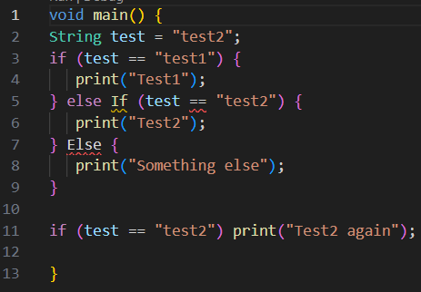
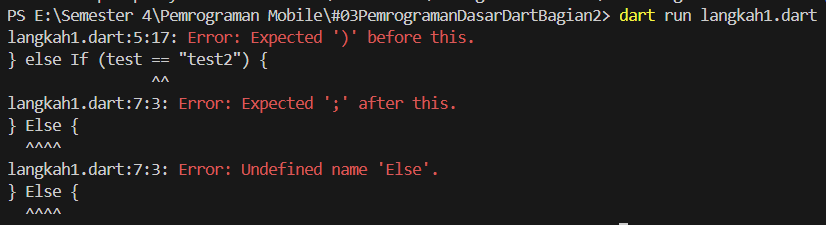
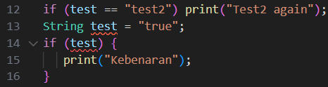
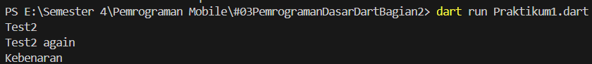
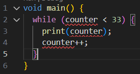
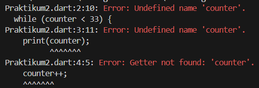
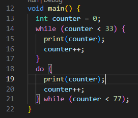
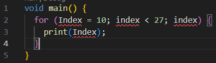
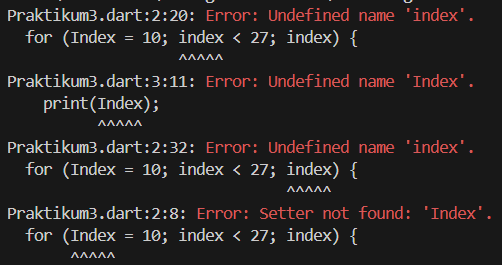
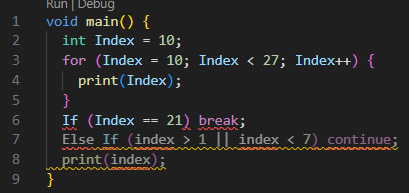

# Laporan Praktikum #02 - Pemrograman Dasar Dart - Bag.2 (Percabangan dan Perulangan)

## Identitas Mahasiswa

| Atribut | Nilai                   |
| ------- | ----------------------- |
| Nama    | Diyah Ramadhani Putri   |
| NIM     | 244107060152            |
| Kelas   | SIB-2E                  |

---

## Tugas Praktikum 3

## PRAKTIKUM 1: Menerapkan Control Flows ("if/else")
### Langkah 1
Ketik atau salin kode program berikut ke dalam fungsi main().



**JAWABAN**

### Langkah 2
Silakan coba eksekusi (Run) kode pada langkah 1 tersebut. Apa yang terjadi? Jelaskan!



**JAWABAN**

### Langkah 3
Tambahkan kode program berikut, lalu coba eksekusi (Run) kode Anda.



Apa yang terjadi ? Jika terjadi error, silakan perbaiki namun tetap menggunakan if/else.   
**JAWABAN**

**Perbaikan Kode**
``` dart
void main() {
  String test = "test2";
  if (test == "test1") {
    print("Test1");
  } else if (test == "test2") {
    print("Test2");
  } else {
    print("Something else");
  }

  if (test == "test2") print("Test2 again");

  String test2 = "true";
  if (test2  == "true") {
    print("Kebenaran");
  }
}
```
**Hasil Kode yang sudah diperbaiki**



## PRAKTIKUM 2: Menerapkan Perulangan "while" dan "do-while"
### Langkah 1
Ketik atau salin kode program berikut ke dalam fungsi main().



### Langkah 2
Silakan coba eksekusi (Run) kode pada langkah 1 tersebut. Apa yang terjadi? Jelaskan! Lalu perbaiki jika terjadi error.



**Perbaikan**
```dart
void main() {
  int counter = 0;
  while (counter < 33) {
    print(counter);
    counter++;
  } 
}
```
**JAWABAN** 

### Langkah 3
Tambahkan kode program berikut, lalu coba eksekusi (Run) kode Anda.



Apa yang terjadi ? Jika terjadi error, silakan perbaiki namun tetap menggunakan do-while.
**JAWABAN** 


## PRAKTIKUM 3: Menerapkan Perulangan "for" dan "break-continue"
### Langkah 1
Ketik atau salin kode program berikut ke dalam fungsi main().




### Langkah 2
Silakan coba eksekusi (Run) kode pada langkah 1 tersebut. Apa yang terjadi? Jelaskan! Lalu perbaiki jika terjadi error.



**Perbaikan**
```dart
void main() {
  int Index = 10;
  for (Index = 10; Index < 27; Index++) {
    print(Index);
  }
}
```

### Langkah 3
Tambahkan kode program berikut di dalam for-loop, lalu coba eksekusi (Run) kode Anda.



Apa yang terjadi ? Jika terjadi error, silakan perbaiki namun tetap menggunakan for dan break-continue.
**Perbaikan**
```dart
void main() {
  int index = 10;
  for (index = 10; index < 27; index++) {
    print(index);
    if (index == 21) break;
    if (index > 1 || index < 7) continue;
    print(index);
  }
}
```
**JAWABAN**

## Tugas Praktikum
1. Silakan selesaikan Praktikum 1 sampai 3, lalu dokumentasikan berupa screenshot hasil pekerjaan beserta penjelasannya!
2.. Buatlah sebuah program yang dapat menampilkan bilangan prima dari angka 0 sampai 201 menggunakan Dart. Ketika bilangan prima ditemukan, maka tampilkan nama lengkap dan NIM Anda.
**JAWABAN**
```dart
void main() {
  String nama = "Diyah Ramadhani Putri";
  String nim = "244107060152";

  for (int i = 0; i <= 201; i++) {
    int pembagi = 0;

    if (i > 1) { 
      for (int j = 1; j <= i; j++) {
        if (i % j == 0) {
          pembagi++;
        }
      }

      if (pembagi == 2) {
        print("Bilangan prima: $i");
        print("Nama: $nama");
        print("NIM: $nim");
        print("----------------------");
      }
    }
  }
}
```


