# Laporan Praktikum #04 | Pengantar Bahasa Pemrograman Dart - Bagian 3 (Collections dan Functions)

## Identitas Mahasiswa

| Atribut | Nilai                   |
| ------- | ----------------------- |
| Nama    | Diyah Ramadhani Putri   |
| NIM     | 244107060152            |
| Kelas   | SIB-2E                  |

---

## Tugas Praktikum 4

## Praktikum 1: Eksperimen Tipe Data List
### Langkah 1   
Ketik atau salin kode program berikut ke dalam void main().

```dart
void main() {
  var list = [1, 2, 3];
  assert(list.length == 3);
  assert(list[1] == 2);
  print(list.length);
  print(list[1]);

  list[1] = 1;
  assert(list[1] == 1);
  print(list[1]);
}
```
### Langkah 2
Silakan coba eksekusi (Run) kode pada langkah 1 tersebut. Apa yang terjadi? Jelaskan!

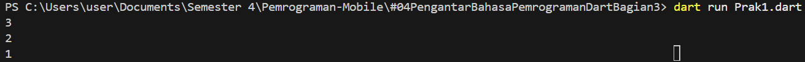

**JAWABAN**

Ketika kode pada langkah 1 dijalankan akan berjalan normal karena semua kondisi assert bernilai true. Program mencetak panjang list (3) nilai pada index ke-1 (2). Setelah itu nilai pada index ke-1 diubah menjadi 1, sehingga saat dicetak lagi hasilnya 1.

### Langkah 3
Ubah kode pada langkah 1 menjadi variabel final yang mempunyai index = 5 dengan default value = null. Isilah nama dan NIM Anda pada elemen index ke-1 dan ke-2. Lalu print dan capture hasilnya.

Apa yang terjadi ? Jika terjadi error, silakan perbaiki.

**JAWABAN**
```dart
void main() {
  final List<dynamic> list = List.filled(5, null);

  list[1] = "Diyah";
  list[2] = "244107060152";

  print(list);
}
```


## Praktikum 2: Eksperimen Tipe Data Set
### Langkah 1
Ketik atau salin kode program berikut ke dalam fungsi main().

```dart
void main() {
  var halogens = {'fluorine', 'chlorine', 'bromine', 'iodine', 'astatine'};
  print(halogens);
}
```

### Langkah 2
Silakan coba eksekusi (Run) kode pada langkah 1 tersebut. Apa yang terjadi? Jelaskan! Lalu perbaiki jika terjadi error.

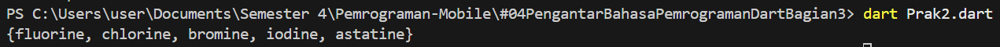

**JAWABAN**

Program berjalan tanpa error karena {} berisi data sehingga dikenali sebagai Set di Dart. Variabel halogens adalah Set kumpulan data yang tidak mempunyai index seperti list dan tidak boleh ada data duplikat.

### Langkah 3
Tambahkan kode program berikut, lalu coba eksekusi (Run) kode Anda

```dart
var names1 = <String>{};
Set<String> names2 = {}; // This works, too.
var names3 = {}; // Creates a map, not a set.

print(names1);
print(names2);
print(names3);
```

Apa yang terjadi ? Jika terjadi error, silakan perbaiki namun tetap menggunakan ketiga variabel tersebut. Tambahkan elemen nama dan NIM Anda pada kedua variabel Set tersebut dengan dua fungsi berbeda yaitu .add() dan .addAll(). Untuk variabel Map dihapus, nanti kita coba di praktikum selanjutnya.

**JAWABAN**

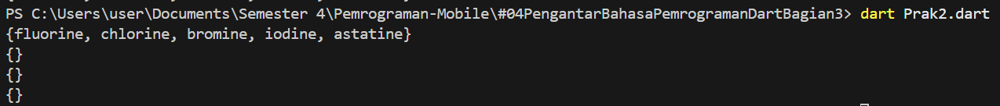

Program tidak error, tapi output yang muncul adalah kosong. karena ketiga variabel tersebut baru dibuat dan belum diberi isi apa pun.

```dart
void main() {
  var halogens = {'fluorine', 'chlorine', 'bromine', 'iodine', 'astatine'};
  print(halogens);

  var names1 = <String>{};
  Set<String> names2 = {};
  var names3 = {}; 

  names1.add("Diyah Ramadhani Putri");
  names2.addAll({"244107060152"});

  print(names1);
  print(names2);
  print(names3);
}
```

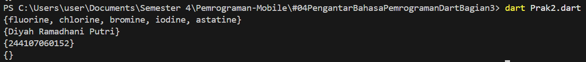

## Praktikum 3: Eksperimen Tipe Data Maps
### Langkah 1
Ketik atau salin kode program berikut ke dalam fungsi main().

```dart
var gifts = {
  // Key:    Value
  'first': 'partridge',
  'second': 'turtledoves',
  'fifth': 1
};

var nobleGases = {
  2: 'helium',
  10: 'neon',
  18: 2,
};

print(gifts);
print(nobleGases);
```
### Langkah 2
Silakan coba eksekusi (Run) kode pada langkah 1 tersebut. Apa yang terjadi? Jelaskan! Lalu perbaiki jika terjadi error.


**JAWABAN**

Saat kode dijalankan, program tidak error karena gifts dan nobleGases merupakan Map (key–value). Program hanya menampilkan isi data Map tersebut di console. 

### Langkah 3
Tambahkan kode program berikut, lalu coba eksekusi (Run) kode Anda.

```dart
var mhs1 = Map<String, String>();
gifts['first'] = 'partridge';
gifts['second'] = 'turtledoves';
gifts['fifth'] = 'golden rings';

var mhs2 = Map<int, String>();
nobleGases[2] = 'helium';
nobleGases[10] = 'neon';
nobleGases[18] = 'argon';
```

Apa yang terjadi ? Jika terjadi error, silakan perbaiki.
Tambahkan elemen nama dan NIM Anda pada tiap variabel di atas (gifts, nobleGases, mhs1, dan mhs2).

**JAWABAN**

Pada kode tambahan, ada kesalahan logika. Program membuat Map baru (mhs1 dan mhs2), tetapi data justru dimasukkan lagi ke gifts dan nobleGases. Jadi Map yang baru dibuat tidak terpakai.

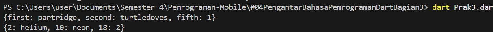

```dart
void main() {
  var gifts = {
    // Key:    Value
    'first': 'partridge',
    'second': 'turtledoves',
    'fifth': 1,
  };

  var nobleGases = {2: 'helium', 10: 'neon', 18: 2};

  print(gifts);
  print(nobleGases);

  var mhs1 = Map<String, String>();
  mhs1['first'] = 'Diyah Ramadhani Putri';
  mhs1['second'] = '244107060152';
  mhs1['fifth'] = 'golden rings';

  var mhs2 = Map<int, String>();
  mhs2[2] = 'helium';
  mhs2[10] = 'neon';
  mhs2[18] = 'argon';

  print(mhs1);
  print(mhs2);
}
```

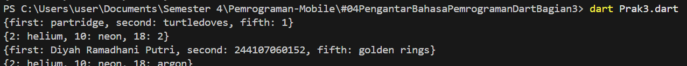

## Praktikum 4: Eksperimen Tipe Data List: Spread dan Control-flow Operators
### Langkah 1
Ketik atau salin kode program berikut ke dalam fungsi main().

```dart
var list = [1, 2, 3];
var list2 = [0, ...list];
print(list1);
print(list2);
print(list2.length);
```
### Langkah 2
Silakan coba eksekusi (Run) kode pada langkah 1 tersebut. Apa yang terjadi? Jelaskan! Lalu perbaiki jika terjadi error.

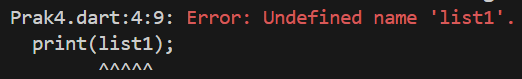

PERBAIKAN
```dart
void main() {
  var list = [1, 2, 3];
  var list2 = [0, ...list];
  print(list);
  print(list2);
  print(list2.length);
}
```

**JAWABAN**

Dari hasil kode langkah 1 terjadi error karena variabel list1 belum pernah dibuat akan tetapi sudah dipanggil di print(list1)

### Langkah 3
Tambahkan kode program berikut, lalu coba eksekusi (Run) kode Anda.

```dart
list1 = [1, 2, null];
print(list1);
var list3 = [0, ...?list1];
print(list3.length);
```

Apa yang terjadi ? Jika terjadi error, silakan perbaiki.

Tambahkan variabel list berisi NIM Anda menggunakan Spread Operators. Dokumentasikan hasilnya dan buat laporannya!

**JAWABAN**

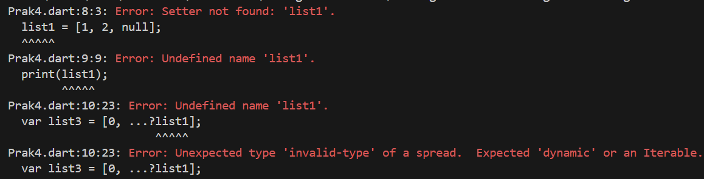

Hasilnya akan error karena list1 belum dibuat sehingga Dart tidak bisa mengenali variabel tersebut (undefined variable). Solusinya adalah menambahkan var saat mendeklarasikan list1.

PERBAIKAN
```dart
void main() {
  var list = [1, 2, 3];
  var list2 = [0, ...list];
  print(list);
  print(list2);
  print(list2.length);

  var list1 = [1, 2, null];
  print(list1);
  var list3 = [0, ...?list1];
  print(list3.length);
}
```
PENAMBAHAN VARIABEL LIST BERISI NIM
```dart
  var nim = ["244107060152"];
  var listNim = [...nim];
  print(listNim);
```

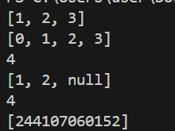

### Langkah 4
Tambahkan kode program berikut, lalu coba eksekusi (Run) kode Anda.

```dart
var nav = ['Home', 'Furniture', 'Plants', if (promoActive) 'Outlet'];
print(nav);
```
Apa yang terjadi ? Jika terjadi error, silakan perbaiki. Tunjukkan hasilnya jika variabel promoActive ketika true dan false.

**JAWABAN**

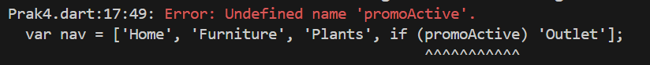

Hasil dari langkah 4 muncul error karena variabel promoActive belum dideklarasikan, sehingga Dart tidak dapat mengenali variabel tersebut. Oleh karena itu perlu ditambahkan deklarasi variabel promoActive terlebih dahulu.

PERBAIKAN 
```dart
  var promoActive = true;
  var nav = ['Home', 'Furniture', 'Plants', if (promoActive) 'Outlet'];
  print(nav);
```

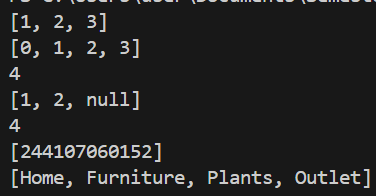

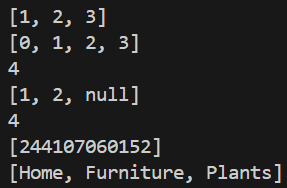

**Penjelasan tambahan**

Jika promoActive bernilai true, maka 'Outlet' ditambahkan ke dalam list. Jika false, maka 'Outlet' tidak dimasukkan.

### Langkah 5
Tambahkan kode program berikut, lalu coba eksekusi (Run) kode Anda.

```dart
var nav2 = ['Home', 'Furniture', 'Plants', if (login case 'Manager') 'Inventory'];
print(nav2);
```
Apa yang terjadi ? Jika terjadi error, silakan perbaiki. Tunjukkan hasilnya jika variabel login mempunyai kondisi lain.

**JAWABAN**

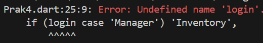

Hasil langkah 5 akan menunjukkan error karena variabel login belum dideklarasikan atau dibuat, sehingga Dart tidak dapat mengenali variabel tersebut. Oleh karena itu perlu ditambahkan variabel login terlebih dahulu.

PERBAIKAN
```dart
  var login = 'Manager';
  var nav2 = [
    'Home',
    'Furniture',
    'Plants',
    if (login case 'Manager') 'Inventory',
  ];
  print(nav2);
```

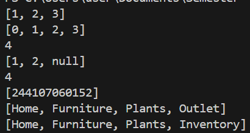

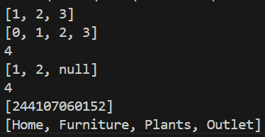

**Penjelasan Tambahan**

Jika variabel login bernilai "Manager", maka kondisi if (login == 'Manager') akan bernilai true sehingga 'Inventory' akan ditambahkan ke dalam list nav2. Sedangkan jika variabel login bukan "Manager" misalnya "user", maka kondisi if (login == 'Manager') bernilai false sehingga 'Inventory' tidak dimasukkan ke dalam list.

### Langkah 6
Tambahkan kode program berikut, lalu coba eksekusi (Run) kode Anda.

```dart
var listOfInts = [1, 2, 3];
var listOfStrings = ['#0', for (var i in listOfInts) '#$i'];
assert(listOfStrings[1] == '#1');
print(listOfStrings);
```
Apa yang terjadi ? Jika terjadi error, silakan perbaiki. Jelaskan manfaat Collection For dan dokumentasikan hasilnya.

**JAWABAN**

Pada langkah 6 program tidak menghasilkan error karena semua variabel sudah dideklarasikan dengan benar. Program membuat list listOfInts berisi [1, 2, 3], lalu menggunakan collection for untuk mengambil setiap elemen dari list tersebut dan mengubahnya menjadi string dengan format #angka. Hasilnya dimasukkan ke listOfStrings yang diawali dengan '#0'. 

HASIL AKHIR PRAKTIKUM 4

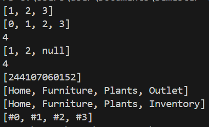

## Praktikum 5: Eksperimen Tipe Data Records
### Langkah 1
Ketik atau salin kode program berikut ke dalam fungsi main().

```dart
var record = ('first', a: 2, b: true, 'last');
print(record)
```

### Langkah 2
Silakan coba eksekusi (Run) kode pada langkah 1 tersebut. Apa yang terjadi? Jelaskan! Lalu perbaiki jika terjadi error.

**JAWABAN**

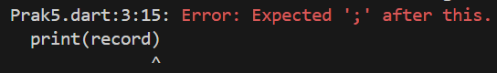

Hasilnya muncul error karena pada kode tidak terdapat tanda titik koma ; di akhir perintah. Setelah tanda ; ditambahkan, program dapat dijalankan dan akan menampilkan isi record yaitu ('first', a: 2, b: true, 'last') yang berisi beberapa nilai dengan tipe data berbeda dalam satu variabel. 

### Langkah 3
Tambahkan kode program berikut di luar scope void main(), lalu coba eksekusi (Run) kode Anda.

```dart
(int, int) tukar((int, int) record) {
  var (a, b) = record;
  return (b, a);
}
```
Apa yang terjadi ? Jika terjadi error, silakan perbaiki. Gunakan fungsi tukar() di dalam main() sehingga tampak jelas proses pertukaran value field di dalam Records.

**JAWABAN**

Pada langkah 3, ditambahkannya sebuah fungsi bernama tukar() di luar main(). Fungsi ini menggunakan tipe data record dengan dua nilai bertipe int. Di dalam fungsi, nilai dari record diambil menggunakan destructuring var (a, b) = record; sehingga nilai pertama disimpan ke a dan nilai kedua ke b. Setelah itu fungsi mengembalikan record baru dengan urutan nilai yang ditukar yaitu (b, a). Jika fungsi ini dipanggil di dalam main(), maka dua nilai pada record tersebut akan bertukar posisi. Misalnya record (10, 20) setelah diproses oleh fungsi tukar() akan menghasilkan (20, 10).

DITAMBAHKANNYA FUNGSI TUKAR DI DALAM MAIN
```dart
void main() {
  var record = ('first', a: 2, b: true, 'last');
  print(record);

  var data = (10, 20);
  var hasil = tukar(data);
  print(hasil);
}

(int, int) tukar((int, int) record) {
  var (a, b) = record;
  return (b, a);
}
```

### Langkah 4
Tambahkan kode program berikut di dalam scope void main(), lalu coba eksekusi (Run) kode Anda.

```dart
// Record type annotation in a variable declaration:
(String, int) mahasiswa;
print(mahasiswa);
```
Apa yang terjadi ? Jika terjadi error, silakan perbaiki. Inisialisasi field nama dan NIM Anda pada variabel record mahasiswa di atas. Dokumentasikan hasilnya dan buat laporannya!

**JAWABAN**

Pada langkah 4 dibuat variabel bernama mahasiswa dengan tipe (String, int). jika langsung dijalankan akan error karena variabel record tersebut belum diinisialisasi atau belum diberi nilai. Oleh karena itu perlu diisi dengan nama dan NIM terlebih dahulu.

```dart
  (String, int) mahasiswa;
  mahasiswa = ('Diyah Ramadhani Putri', 244107060152);
  print(mahasiswa);
```

### Langkah 5
Tambahkan kode program berikut di dalam scope void main(), lalu coba eksekusi (Run) kode Anda.

```dart
var mahasiswa2 = ('first', a: 2, b: true, 'last');

print(mahasiswa2.$1); // Prints 'first'
print(mahasiswa2.a); // Prints 2
print(mahasiswa2.b); // Prints true
print(mahasiswa2.$2); // Prints 'last'
```
Apa yang terjadi ? Jika terjadi error, silakan perbaiki. Gantilah salah satu isi record dengan nama dan NIM Anda, lalu dokumentasikan hasilnya dan buat laporannya!

**JAWABAN**

Pada langkah 5 dibuat sebuah record bernama mahasiswa2 yang berisi beberapa nilai dengan field posisi dan field bernama. Kemudian menampilkan setiap isi record menggunakan akses posisi seperti $1 dan $2, serta menggunakan nama field seperti a dan b. Ketika kode dijalankan, setiap nilai di dalam record akan dicetak sesuai field yang dipanggil.

HASIL AKHIR PRAKTIKUM 5

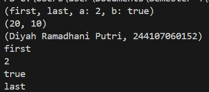

## Tugas Praktikum
### Nomor 1
Silakan selesaikan Praktikum 1 sampai 5, lalu dokumentasikan berupa screenshot hasil pekerjaan Anda beserta penjelasannya!

### Nomor 2
Jelaskan yang dimaksud Functions dalam bahasa Dart!

**JAWABAN**

Function dalam Dart adalah blok kode yang digunakan untuk menjalankan suatu tugas tertentu. Function dibuat agar program lebih rapi, mudah digunakan kembali, dan tidak perlu menulis kode yang sama berulang-ulang karena bisa memanggil function tersebut ketika dibutuhkan. Function bisa menerima parameter (input) dan bisa mengembalikan nilai (return value).

### Nomor 3
Jelaskan jenis-jenis parameter di Functions beserta contoh sintaksnya!

**JAWABAN**

1. Required Parameter
  Required parameter adalah parameter yang harus diisi saat function dipanggil. Jika tidak diisi maka program akan error.
  ```dart
  void sapa(String nama) {
  print("Halo $nama");
  }

  void main() {
    sapa("Diyah");
  }
  ```
2. Optional Positional Parameter
  Optional positional parameter adalah parameter tambahan yang tidak wajib diisi dan ditulis menggunakan tanda kurung siku [ ].
  ```dart
  void sapa(String nama, [String? pesan]) {
    print("Halo $nama");
    print(pesan);
  }

  void main() {
    sapa("Diyah");
  }
  ```
3. Named Parameter
  Named parameter adalah parameter yang dipanggil dengan menyebutkan nama parameternya dan ditulis menggunakan kurung kurawal { }.
  ```dart
  void dataMahasiswa({String? nama, int? umur}) {
  print("Nama: $nama");
  print("Umur: $umur");
  }

  void main() {
    dataMahasiswa(nama: "Diyah", umur: 20);
  }
  ```

### Nomor 4
Jelaskan maksud Functions sebagai first-class objects beserta contoh sintaknya!

**JAWABAN**

Functions sebagai first-class objects adalah function yang diperlakukan seperti data atau variabel. Jadi function bisa disimpan dalam variabel, dikirim sebagai parameter ke function lain, atau dikembalikan dari function. Dengan konsep ini, function menjadi lebih fleksibel untuk digunakan dalam program.

CONTOH:
```dart
void greet(String name) {
  print('Hello, $name!');
}

void main() {
  var sayHello = greet;
  sayHello('Diyah Ramadhani');   
}
```

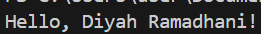

### Nomor 5
Apa itu Anonymous Functions? Jelaskan dan berikan contohnya!

**JAWABAN**

Anonymous Function adalah function yang tidak mempunyai nama dan biasanya digunakan secara langsung di perintah atau sebagai parameter pada function lain. Anonymous function digunakan ketika function hanya dipakai sekali jadi tidak perlu membuat function dengan nama khusus.

CONTOH:
```dart
void show(fn) {
  for (var i = 0; i < 10; i++) {
    if (fn(i)) {
      print(i);
    }
  }
}

void main() {
  show((int x) {
    return x % 2 == 0;
  });
}
```

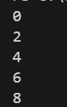

### Nomor 6
Jelaskan perbedaan Lexical scope dan Lexical closures! Berikan contohnya!

**JAWABAN**

1. **Lexical Scope** adalah suatu function yang dapat mengakses variabel berada di lingkup (scope) tempat function tersebut dibuat. Yang artinya, function bisa menggunakan variabel yang dideklarasikan di luar function selama masih berada dalam ruang lingkup kode tersebut.

```dart
void main() {
  var nama = "Diyah";
  var nim = "244106070152";

  void tampil() {
    print(nama);
    print(nim);
  }

  tampil();
}
```

.png)


2. **Lexical Closure** adalah function yang masih bisa mengakses variabel dari scope luar meskipun function tersebut dijalankan di tempat lain. Terjadi ketika sebuah function “mengingat” variabel dari lingkungan tempat function itu dibuat.

```dart
Function buatCounter() {
  int count = 0;

  return () {
    count++;
    return count;
  };
}

void main() {
  var counter = buatCounter();
  print(counter());
  print(counter());
}
```

.png)

### Nomor 7
Jelaskan dengan contoh cara membuat return multiple value di Functions!

**JAWABAN**

```DART
(int, String, int, String) dataSaya() {
  return (244107060152, "Diyah Ramadhani Putri", 20, "Sistem Informasi Bisnis");
}

void main() {
  var (a, b, c, d) = dataSaya();
  print("NIM   : ${a}");
  print("NAMA  : ${b}");
  print("UMUR  : ${c}");
  print("PRODI : ${d}");

}
```

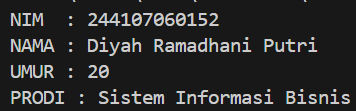

Return multiple value pada function bisa dilakukan menggunakan record. Record memungkinkan sebuah function mengembalikan beberapa nilai sekaligus dalam satu return. Pada contoh yang saya buat function dataSaya mengembalikan 4 nilai yaitu ada Nim, nama, umur, dan prodi dalam bentuk record (int, String, int, String). Kemudian di dalam main(). Nilai-nilainya dipisahkan di dalam variabel a, b, c, dan d menggunakan destructuring record. setelah itu nilai dicetak menggunakan print().