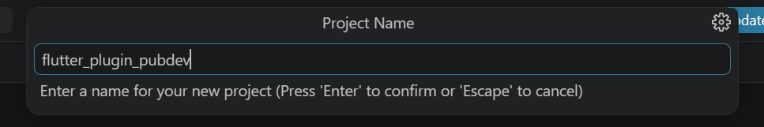
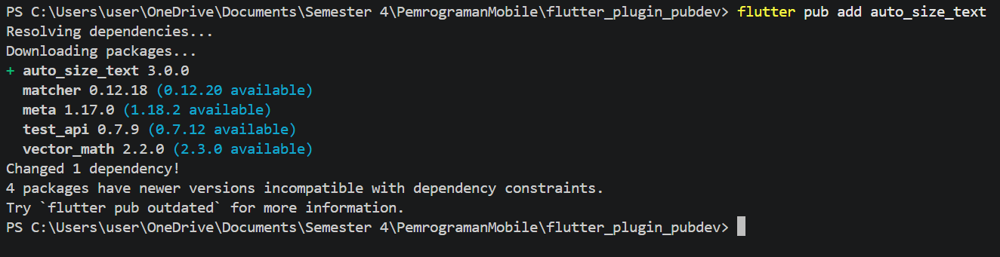
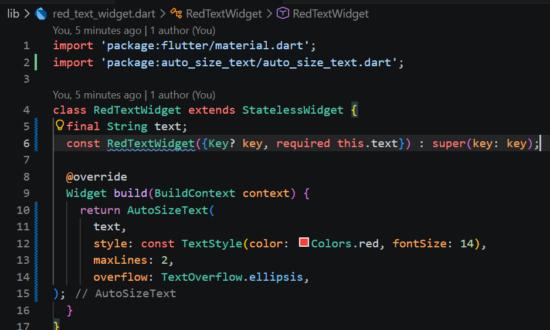
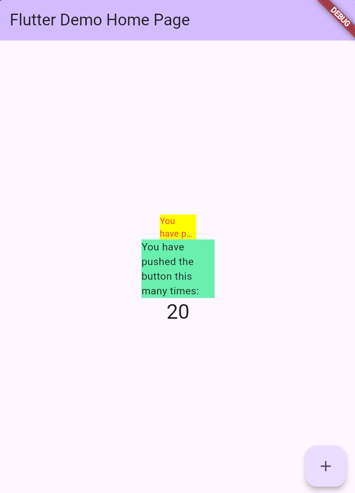

# Laporan Praktikum #07 | Manajemen Plugin

## Identitas Mahasiswa

| Atribut | Nilai                   |
| ------- | ----------------------- |
| Nama    | Diyah Ramadhani Putri   |
| NIM     | 244107060152            |
| Kelas   | SIB-2E                  |

**Link Repository:** [flutter_plugin_pubdev](https://github.com/dyhptri/flutter_plugin_pubdev.git)

## Praktikum Menerapkan Plugin di Project Flutter
### Langkah 1: Buat Project Baru
Buatlah sebuah project flutter baru dengan nama flutter_plugin_pubdev. Lalu jadikan repository di GitHub Anda dengan nama flutter_plugin_pubdev.



### Langkah 2: Menambahkan Plugin
Tambahkan plugin auto_size_text menggunakan perintah berikut di terminal
```dart
flutter pub add auto_size_text
```



Jika berhasil, maka akan tampil nama plugin beserta versinya di file pubspec.yaml pada bagian dependencies.

Prak.png)

### Langkah 3: Buat file red_text_widget.dart
Buat file baru bernama red_text_widget.dart di dalam folder lib lalu isi kode seperti berikut.

Prak.png)

```dart
import 'package:flutter/material.dart';

class RedTextWidget extends StatelessWidget {
  const RedTextWidget({Key? key}) : super(key: key);

  @override
  Widget build(BuildContext context) {
    return Container();
  }
}
```

Prak.png)

### Langkah 4: Tambah Widget AutoSizeText
Masih di file red_text_widget.dart, untuk menggunakan plugin auto_size_text, ubahlah kode return Container() menjadi seperti berikut.

Prak.png)
```dart
return AutoSizeText(
      text,
      style: const TextStyle(color: Colors.red, fontSize: 14),
      maxLines: 2,
      overflow: TextOverflow.ellipsis,
);
```
Setelah Anda menambahkan kode di atas, Anda akan mendapatkan info error. Mengapa demikian? Jelaskan dalam laporan praktikum Anda!

*Jawab*
Implementasi komponen RedTextWidget sebelumnya gagal dikompilasi karena dua hal, yaitu belum adanya dependensi tambahan dan penggunaan variabel yang belum didefinisikan. Masalah pertama muncul karena widget AutoSizeText bukan bagian dari Flutter SDK bawaan, jadi perlu ditambahkan dulu library auto_size_text di file pubspec.yaml dan di-import di bagian atas kode supaya bisa dikenali. Selain itu, ada juga kesalahan logika karena variabel text dipakai di dalam method build, tapi belum dideklarasikan di dalam kelas. Solusinya adalah dengan menambahkan variabel text sebagai properti final bertipe String dan memasukkannya ke constructor dengan keyword required. Dengan perbaikan ini, teks bisa dikirim langsung saat widget dipanggil, jadi lebih fleksibel dan bisa dipakai ulang untuk berbagai kebutuhan, tapi tetap dengan gaya teks merah dan batas jumlah baris yang sama.

*Perbaikan*

Prak.png)

### Langkah 5: Buat Variabel text dan parameter di constructor
Tambahkan variabel text dan parameter di constructor seperti berikut.
```dart
final String text;

const RedTextWidget({Key? key, required this.text}) : super(key: key);
```



### Langkah 6: Tambahkan widget di main.dart
Buka file main.dart lalu tambahkan di dalam children: pada class _MyHomePageState
```dart
Container(
   color: Colors.yellowAccent,
   width: 50,
   child: const RedTextWidget(
             text: 'You have pushed the button this many times:',
          ),
),
Container(
    color: Colors.greenAccent,
    width: 100,
    child: const Text(
           'You have pushed the button this many times:',
          ),
),
```

Prak.png)

Run aplikasi tersebut dengan tekan F5, maka hasilnya akan seperti berikut.

Prak.png)

*Hasil*



## TUGAS PRAKTIKUM
1. Selesaikan Praktikum tersebut, lalu dokumentasikan dan push ke repository Anda berupa screenshot hasil pekerjaan beserta penjelasannya di file README.md!
2. Jelaskan maksud dari langkah 2 pada praktikum tersebut!
3. Jelaskan maksud dari langkah 5 pada praktikum tersebut!
4. Pada langkah 6 terdapat dua widget yang ditambahkan, jelaskan fungsi dan perbedaannya!
Jelaskan maksud dari tiap parameter yang ada di dalam plugin auto_size_text berdasarkan tautan pada dokumentasi ini !
5. kumpulkan laporan praktikum Anda berupa link repository GitHub kepada dosen!