# Laporan Praktikum #11 | Pemrograman Asynchronous

## Identitas Mahasiswa

| Atribut | Nilai                   |
| ------- | ----------------------- |
| Nama    | Diyah Ramadhani Putri   |
| NIM     | 244107060152            |
| Kelas   | SIB-2E                  |

**Link Repository:** [books](https://github.com/dyhptri/books.git)

## Praktikum 1: Mengunduh Data dari Web Service (API)
### Langkah 1: Buat Project Baru
Buatlah sebuah project flutter baru dengan nama books di folder src week-11 repository GitHub Anda.

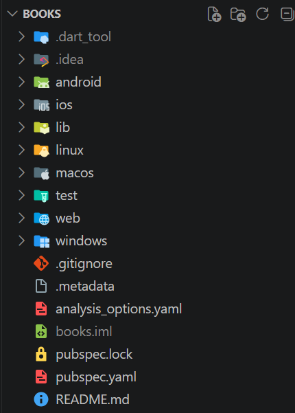

Kemudian Tambahkan dependensi http dengan mengetik perintah berikut di terminal.
```dart
flutter pub add http
```

Prak1.png)

### Langkah 2: Cek file pubspec.yaml
Jika berhasil install plugin, pastikan plugin http telah ada di file pubspec ini seperti berikut.
```dart
dependencies:
  flutter:
    sdk: flutter
  http: ^1.1.0
```

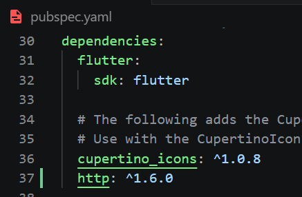

### Langkah 3: Buka file main.dart
Ketiklah kode seperti berikut ini.

Soal 1
Tambahkan nama panggilan Anda pada title app sebagai identitas hasil pekerjaan Anda.
```dart
import 'dart:async';
import 'package:flutter/material.dart';
import 'package:http/http.dart';
import 'package:http/http.dart' as http;

void main() {
runApp(const MyApp());

class MyApp extends Statelesswidget {
const MyApp({super.key});

@override
Widget build(BuildContext context) {
return MaterialApp(
title: 'Future Demo',
theme: ThemeData(
primarySwatch: Colors.blue,
visualDensity: VisualDensity.adaptivePlatformDensity,

home: const FuturePage(),

class FuturePage extends StatefulWidget {
const FuturePage({super.key});

@override
State<FuturePage> createState() => _FuturePageState();

class _FuturePageState extends State<FuturePage> {
String result = ";
@override
Widget build(BuildContext context) {
return Scaffold(
appBar: AppBar(
title: const Text('Back from the Future'),

body: Center(
child: Column(children: [
const Spacer(),
ElevatedButton(
child: const Text('GO!'),
onPressed: () {},
,
const Spacer(),
Text(result),
const Spacer(),
const CircularProgressIndicator(),
const Spacer(),
```

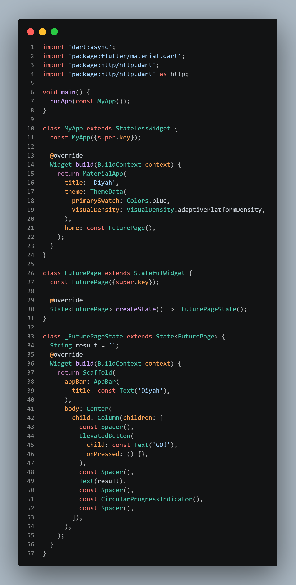

Catatan:
Tidak ada yang spesial dengan kode di main.dart tersebut. Perlu diperhatikan di kode tersebut terdapat widget CircularProgressIndicator yang akan menampilkan animasi berputar secara terus-menerus, itu pertanda bagus bahwa aplikasi Anda responsif (tidak freeze/lag). Ketika animasi terlihat berhenti, itu berarti UI menunggu proses lain sampai selesai.

### Langkah 4: Tambah method getData()
Tambahkan method ini ke dalam class _FuturePageState yang berguna untuk mengambil data dari API Google Books.
```dart
Future<Response> getData() async {
const authority = 'www.googleapis.com';
const path = '/books/v1/volumes/junbDwAAQBAJ';
Uri url = Uri.https(authority, path);
return http.get(url);
}
```

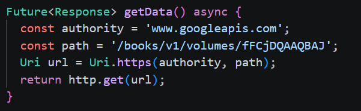

Soal 2
1. Carilah judul buku favorit Anda di Google Books, lalu ganti ID buku pada variabel path di kode tersebut. Caranya ambil di URL browser Anda seperti gambar berikut ini.

.png)

2. Kemudian cobalah akses di browser URI tersebut dengan lengkap seperti ini. Jika menampilkan data JSON, maka Anda telah berhasil. Lakukan capture milik Anda dan tulis di README pada laporan praktikum. Lalu lakukan commit dengan pesan "W11: Soal 2".

.png)

.png)

### Langkah 5: Tambah kode di ElevatedButton
Tambahkan kode pada onPressed di ElevatedButton seperti berikut.
```dart
ElevatedButton(
child: Text('GO!'),
onPressed: (){
setState((){});
getData()
.then((value) {
result = value.body.toString().substring(0, 450);
setState(() {});
}).catchError((_){
result = 'An error occurred';
setState(() {});

});

},

),
```
Lakukan run aplikasi Flutter Anda. Anda akan melihat tampilan akhir seperti gambar berikut. Jika masih terdapat error, silakan diperbaiki hingga bisa running.

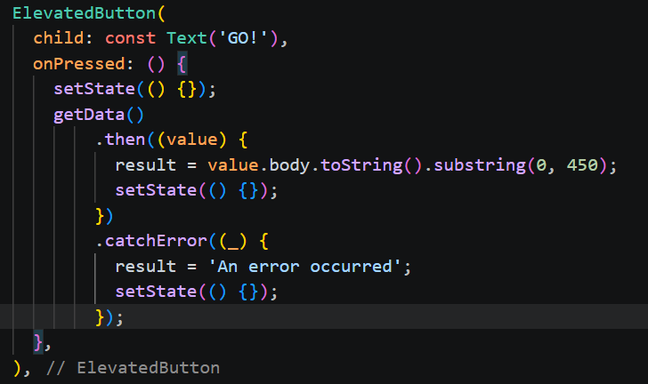

Soal 3
1. Jelaskan maksud kode langkah 5 tersebut terkait substring dan catchError!

*Jawab*

substring(0, 450) itu dipakai untuk motong teks dari indeks ke-0 sampai ke-450, jadi hanya mengambil 450 karakter pertama saja. Di konteks aplikasi ini, data dari API Google Books bentuknya JSON dan panjang, jadi jika ditampilkan semua bisa bikin UI berantakan atau overflow. Jadi dipotong agar tampilannya tetap rapi dan enak dilihat.
Sedangkan catchError dipakai untuk handle error saat proses async, jadi seperti mengambil data dari internet. Proses ini bisa saja gagal, misalnya karena koneksi jelek atau server bermasalah. Jika gagal, catchError akan menangkap error-nya supaya aplikasi tidak crash. Biasanya diberi pesan “An error occurred” lalu UI di-update, jadi user tetap dapet feedback, bukan layar kosong.

2. Capture hasil praktikum Anda berupa GIF dan lampirkan di README. Lalu lakukan commit dengan pesan "W11: Soal 3".

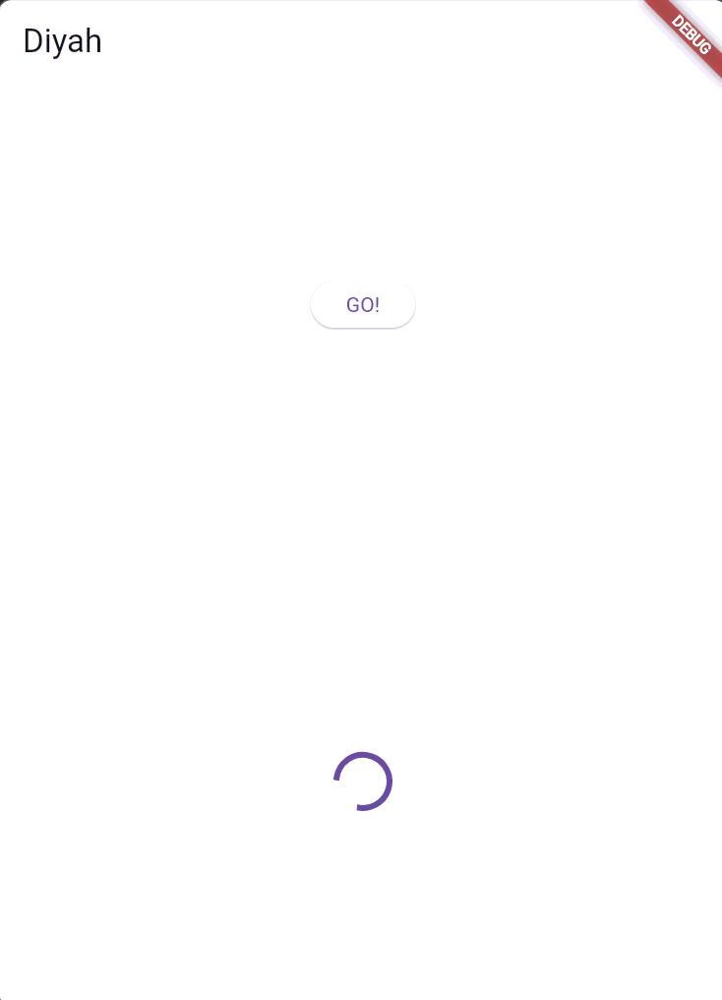


## Praktikum 2: Menggunakan await/async untuk menghindari callbacks
### Langkah 1: Buka file main.dart
Tambahkan tiga method berisi kode seperti berikut di dalam class _FuturePageState.
```dart
Future<int> returnOneAsync() async {
  await Future.delayed(const Duration(seconds: 3));
  return 1;
}

Future<int> returnTwoAsync() async {
  await Future.delayed(const Duration(seconds: 3));
  return 2;
}

Future<int> returnThreeAsync() async {
  await Future.delayed(const Duration(seconds: 3));
  return 3;
} 
```

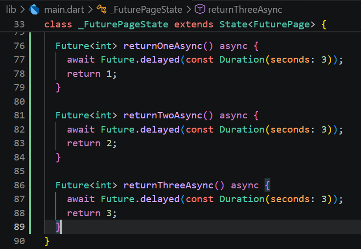

### Langkah 2: Tambah method count()
Lalu tambahkan lagi method ini di bawah ketiga method sebelumnya.

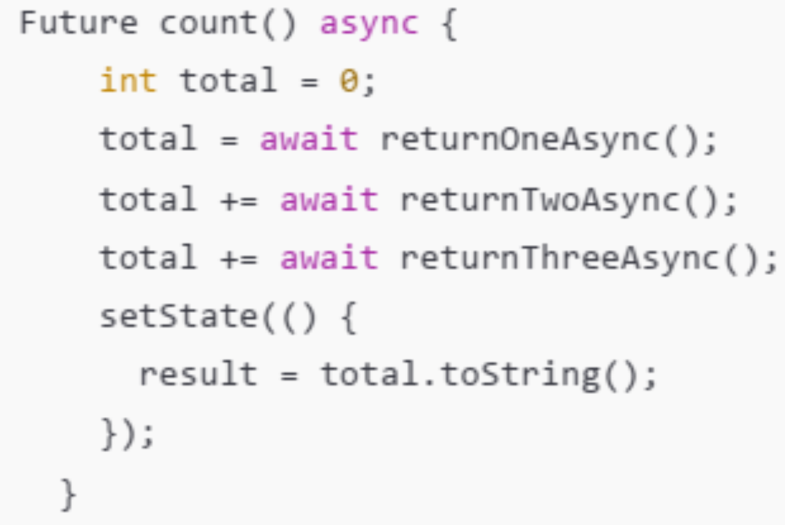

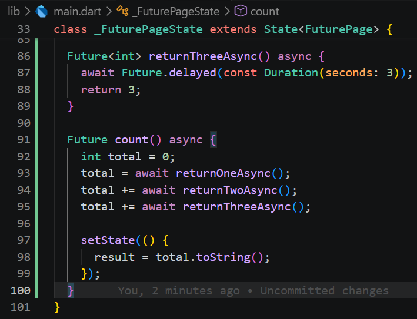

### Langkah 3: Panggil count()
Lakukan comment kode sebelumnya, ubah isi kode onPressed() menjadi seperti berikut.

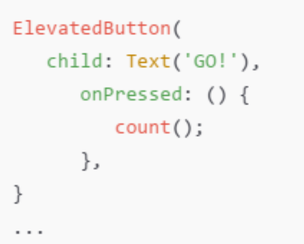

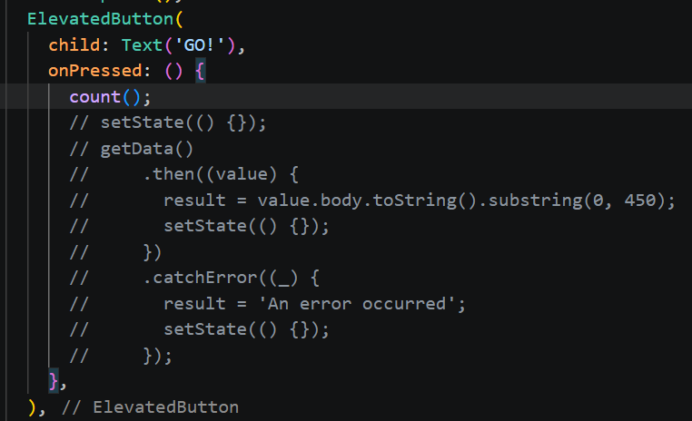

### Langkah 4: Run
Akhirnya, run atau tekan F5 jika aplikasi belum running. Maka Anda akan melihat seperti gambar berikut, hasil angka 6 akan tampil setelah delay 9 detik.

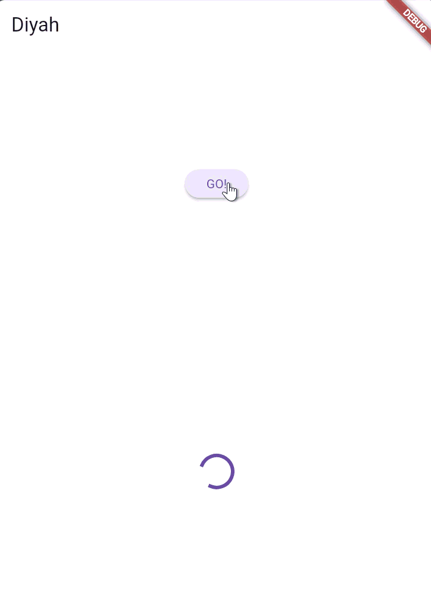

Soal 4
1. Jelaskan maksud kode langkah 1 dan 2 tersebut!

*Jawab*

**Di langkah 1**, bikin tiga method yaitu returnOneAsync(), returnTwoAsync(), dan returnThreeAsync() yang semuanya pakai Future<int> dan async. Artinya, fungsi ini jalan di background dan hasilnya baru dikasih nanti. Di dalamnya ada await Future.delayed(Duration(seconds: 3)) yang cuma simulasi delay 3 detik, seolah-olah lagi nunggu respon dari server. Setelah nunggu, masing-masing fungsi bakal return nilai 1, 2, dan 3.

**Di langkah 2**, ada method count() yang jadi pengatur jalannya. Di sini ketiga fungsi tadi dipanggil secara berurutan pakai await, jadi harus nunggu satu selesai dulu baru lanjut ke berikutnya. Awalnya total = 0, lalu ditambah hasil dari returnOneAsync() jadi 1, lanjut nambah dari returnTwoAsync() jadi 3, dan terakhir dari returnThreeAsync() jadi 6. Karena semuanya nunggu 3 detik satu per satu, total waktunya jadi 9 detik. Setelah semua selesai, setState dipanggil supaya UI di-update dan menampilkan hasil akhirnya yaitu 6.

2. Capture hasil praktikum Anda berupa GIF dan lampirkan di README. Lalu lakukan commit dengan pesan "W11: Soal 4".


## Praktikum 3: Menggunakan Completer di Future
### Langkah 1: Buka main.dart
Pastikan telah impor package async berikut.
```dart
import 'package:async/async.dart';
```

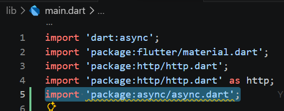

### Langkah 2: Tambahkan variabel dan method
Tambahkan variabel late dan method di class _FuturePageState seperti ini.
```dart
late Completer completer;

Future getNumber() {
  completer = Completer<int>();
  calculate();
  return completer.future;
}

Future calculate() async {
  await Future.delayed(const Duration(seconds : 5));
  completer.complete(42);
}
```

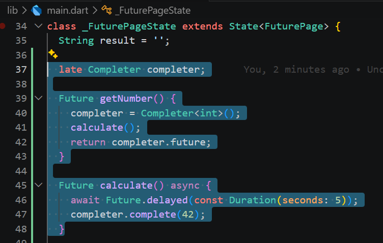

### Langkah 3: Ganti isi kode onPressed()
Tambahkan kode berikut pada fungsi onPressed(). Kode sebelumnya bisa Anda comment.

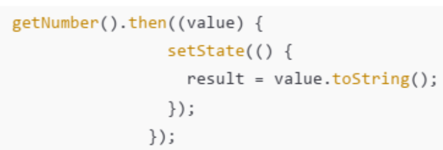

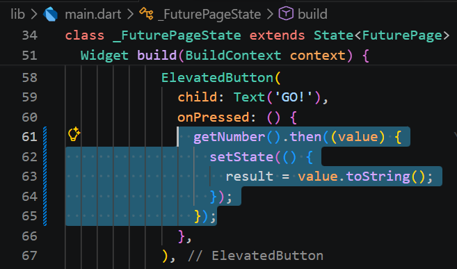

### Langkah 4:
Terakhir, run atau tekan F5 untuk melihat hasilnya jika memang belum running. Bisa juga lakukan hot restart jika aplikasi sudah running. Maka hasilnya akan seperti gambar berikut ini. Setelah 5 detik, maka angka 42 akan tampil.

.gif)

Soal 5
1. Jelaskan maksud kode langkah 2 tersebut!

*Jawab*

Di bagian deklarasi variabel, late Completer completer digunakan untuk menyiapkan wadah bernama completer yang nanti akan diisi. Kata late artinya variabel ini belum langsung dikasih nilai saat dibuat, tapi dijamin bakal diisi sebelum dipakai.

Di method getNumber(), fungsi ini dipanggil saat tombol ditekan. Pertama, completer = Completer<int>() membuat objek Completer yang nantinya akan menghasilkan nilai bertipe integer. Lalu calculate() dipanggil untuk mulai proses di background tanpa await, jadi program nggak nunggu prosesnya selesai. Setelah itu, return completer.future langsung mengembalikan “janji” berupa future ke UI, jadi UI bisa lanjut dulu sambil nunggu hasilnya.

Sedangkan di method calculate(), di sinilah proses yang agak lama dijalankan. Ada await Future.delayed(Duration(seconds: 5)) yang mensimulasikan delay 5 detik, misalnya kayak lagi ambil data dari server. Setelah selesai, completer.complete(42) dipanggil untuk ngisi hasil ke dalam Completer. Jadi future yang tadi dikembalikan di getNumber() akhirnya terpenuhi dengan nilai 42, dan UI bisa menampilkan hasilnya tanpa bikin aplikasi nge-freeze.

2. Capture hasil praktikum Anda berupa GIF dan lampirkan di README. Lalu lakukan commit dengan pesan "W11: Soal 5".

.gif)


### Langkah 5: Ganti method calculate()
Gantilah isi code method calculate() seperti kode berikut, atau Anda dapat membuat calculate2()

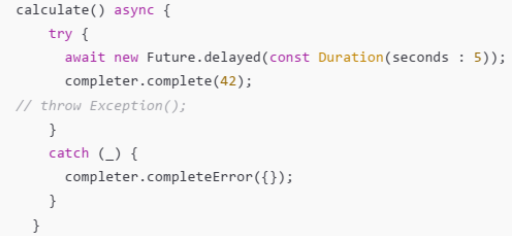

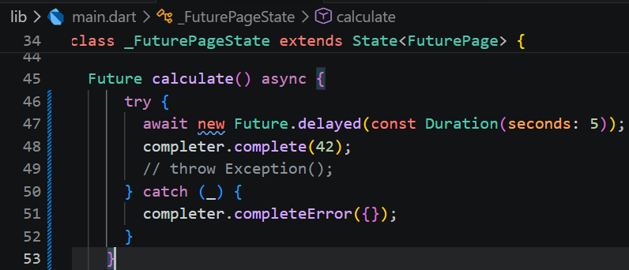

### Langkah 6: Pindah ke onPressed()
Ganti menjadi kode seperti berikut.
```dart
getNumber().then((value) {
  setState(() {
    result = value.toString();
  });
}).catchError((e) {
  result = 'An error occurred';
});
```

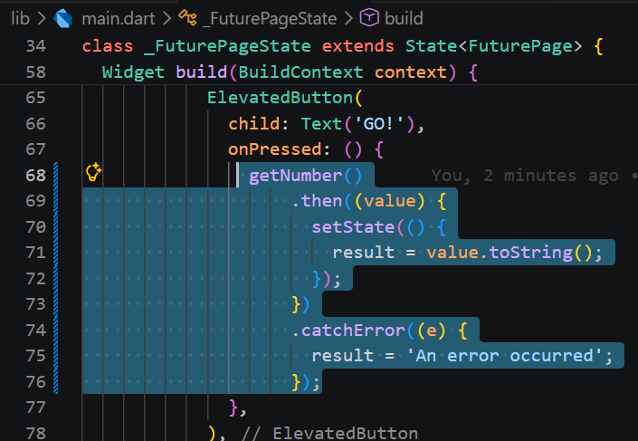

Soal 6
1. Jelaskan maksud perbedaan kode langkah 2 dengan langkah 5-6 tersebut!

*Jawab*

Perbedaan antara langkah 2 dengan langkah 5–6 itu ada di penambahan error handling. Di langkah 2, kode masih sederhana karena cuma mengasumsikan semua proses async bakal berhasil. Jadi setelah proses selesai, langsung kirim hasil pakai completer.complete(42) tanpa mikirin kemungkinan gagal.
Lanjut, mulai langkah 5, method calculate() dibungkus dengan try-catch. Artinya program disuruh “coba dulu”, tapi kalau ada error, error itu tidak membuat aplikasi crash. Sebaliknya, error akan ditangkap di catch dan dikirim lewat completer.completeError().
Lanjut ke langkah 6, di bagian UI ditambahin .catchError() untuk menangkap error yang dikirim tadi. Jadi terjadi kegagalan, aplikasi tidak blank atau force close, tapi akan menampilkan pesan seperti “An error occurred”. Dengan ini, aplikasi jadi lebih aman dan user tetap dapet feedback yang jelas kalau prosesnya gagal.

2. Capture hasil praktikum Anda berupa GIF dan lampirkan di README. Lalu lakukan commit dengan pesan "W11: Soal 6".

.gif)


## Praktikum 4: Memanggil Future secara paralel
Ketika Anda membutuhkan untuk menjalankan banyak Future secara bersamaan, ada sebuah class yang dapat Anda gunakan yaitu: FutureGroup.

FutureGroup tersedia di package async, yang mana itu harus diimpor ke file dart Anda, seperti berikut.
```dart
import 'package:async/async.dart';
```

### Langkah 1: Buka file main.dart
Tambahkan method ini ke dalam class _FuturePageState

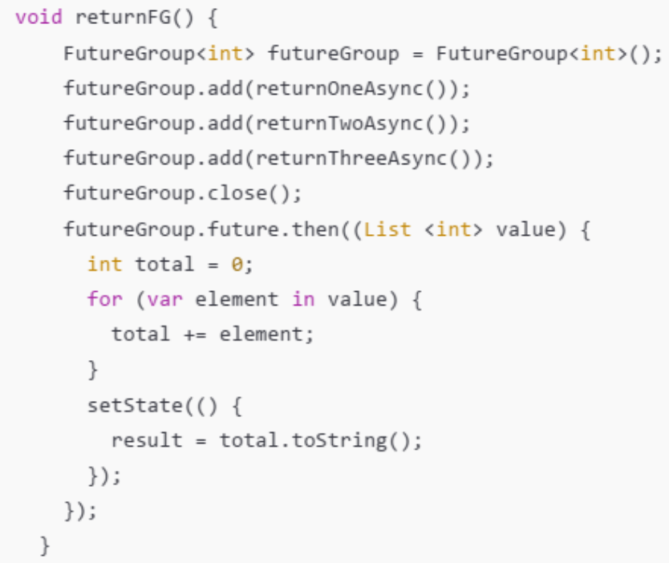

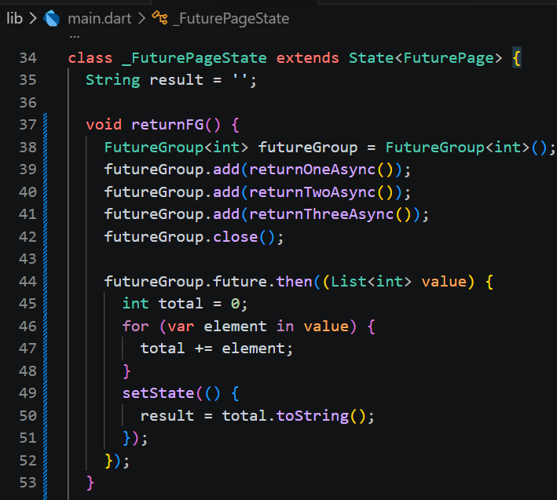

### Langkah 2: Edit onPressed()
Anda bisa hapus atau comment kode sebelumnya, kemudian panggil method dari langkah 1 tersebut.

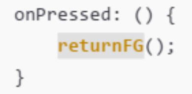

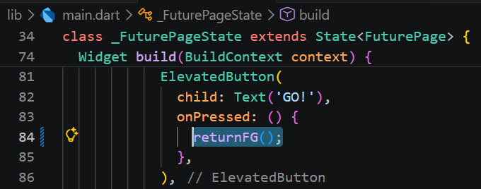

### Langkah 3: Run
Anda akan melihat hasilnya dalam 3 detik berupa angka 6 lebih cepat dibandingkan praktikum sebelumnya menunggu sampai 9 detik.

Soal 7
Capture hasil praktikum Anda berupa GIF dan lampirkan di README. Lalu lakukan commit dengan pesan "W11: Soal 7".

.gif)

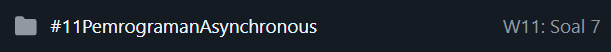

### Langkah 4: Ganti variabel futureGroup
Anda dapat menggunakan FutureGroup dengan Future.wait seperti kode berikut.
```dart
final futures = Future.wait<int>([
  returnOneAsync(),
  returnTwoAsync(),
  returnThreeAsync(),
]);
```
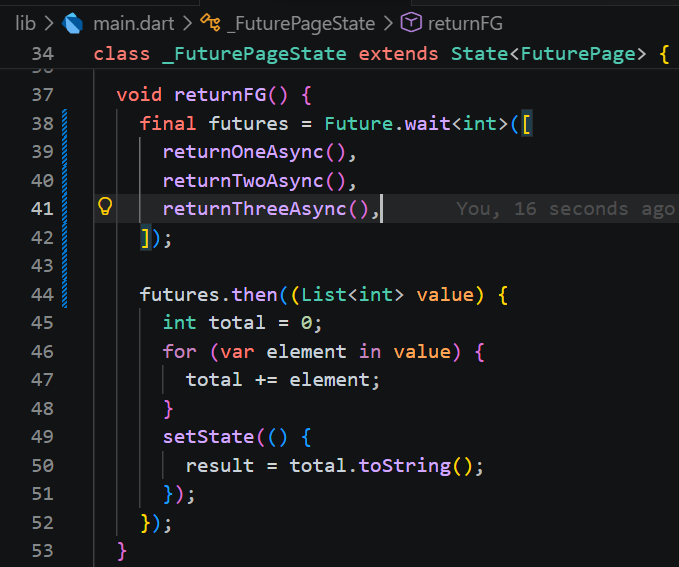

Soal 8
Jelaskan maksud perbedaan kode langkah 1 dan 4!

*Jawab*

Perbedaan antara langkah 1 dan langkah 4 itu ada di cara menjalankan beberapa Future secara paralel.
Di langkah 1, pakai FutureGroup dari package eksternal async. Cara ini lebih manual karena harus bikin objek grup dulu, lalu nambahin Future satu per satu pakai .add(), dan ditutup dengan .close() biar prosesnya mulai. Pendekatan ini cocok kalau jumlah Future-nya belum pasti dari awal dan bisa nambah secara dinamis saat program berjalan.
Sedangkan di langkah 4, pakai Future.wait yang merupakan bawaan Dart. Cara ini lebih simpel dan ringkas karena cukup masukin semua Future ke dalam List sekaligus. Nggak perlu .close() karena langsung diproses. Biasanya ini jadi pilihan utama kalau jumlah Future-nya sudah jelas dari awal.

.gif)


## Praktikum 5: Menangani Respon Error pada Async Code
### Langkah 1: Buka file main.dart
Tambahkan method ini ke dalam class _FuturePageState
 
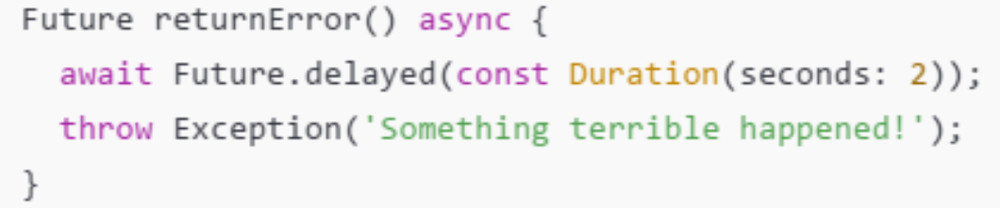

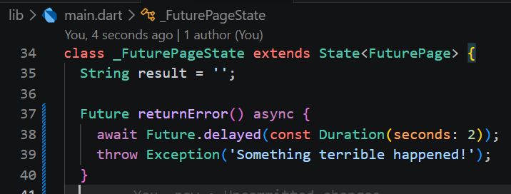

### Langkah 2: ElevatedButton
Ganti dengan kode berikut

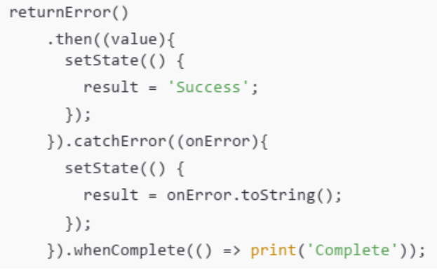

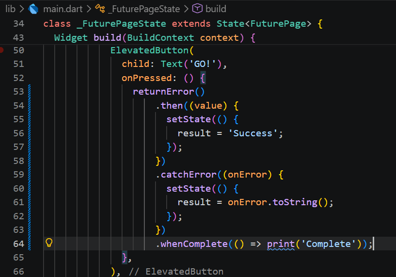

### Langkah 3: Run
Lakukan run dan klik tombol GO! maka akan menghasilkan seperti gambar berikut.

.png)

Pada bagian debug console akan melihat teks Complete seperti berikut.

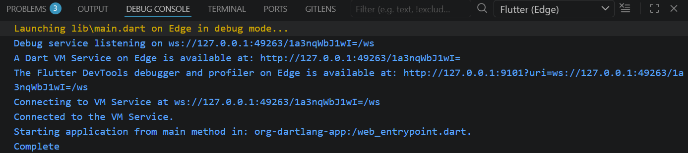

Soal 9
Capture hasil praktikum Anda berupa GIF dan lampirkan di README. Lalu lakukan commit dengan pesan "W11: Soal 9"

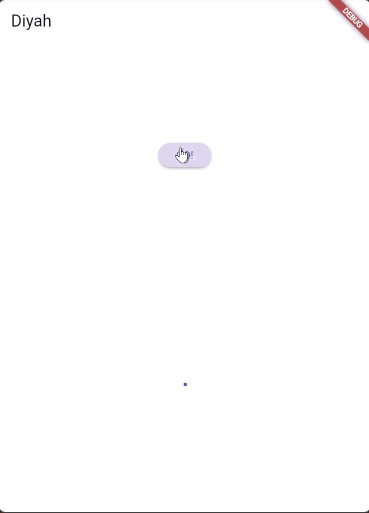


### Langkah 4: Tambah method handleError()
Tambahkan kode ini di dalam class _FutureStatePage

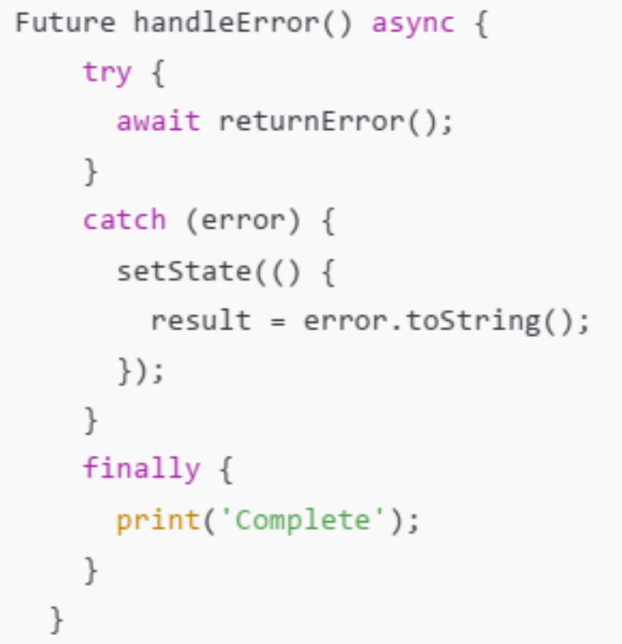

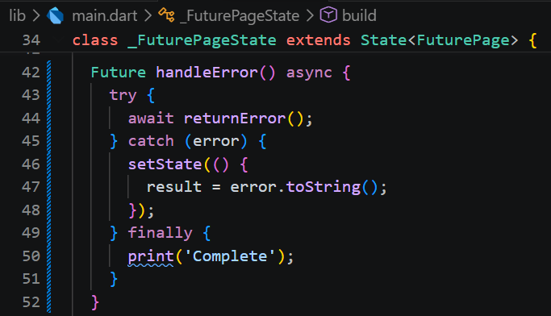

soal 10
Panggil method handleError() tersebut di ElevatedButton, lalu run. Apa hasilnya? Jelaskan perbedaan kode langkah 1 dan 4!

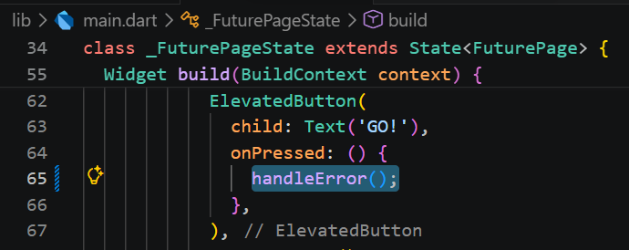

.gif)

*Jawab*

Perbedaan utamanya ada di gaya penulisan saat handle error di proses asynchronous.
Pendekatan sebelumnya pakai .then, .catchError, dan .whenComplete yang sifatnya callback chaining. Jadi kodenya ditulis berantai dan cukup efektif, tapi kalau sudah panjang biasanya jadi agak susah dibaca karena terlihat “bersarang”.

Sedangkan di langkah 4 pakai async/await dengan try-catch-finally. Pendekatan ini bikin alur kode kelihatan lebih urut kayak kode biasa (synchronous), jadi lebih rapi dan gampang dipahami. try dipakai buat ngejalanin proses, catch buat nangkep error kalau ada masalah, dan finally buat kode yang pasti dijalankan, entah berhasil atau gagal.

## Praktikum 6: Menggunakan Future dengan StatefulWidget
### Langkah 1: install plugin geolocator
Tambahkan plugin geolocator dengan mengetik perintah berikut di terminal.
```dart
flutter pub add geolocator
```

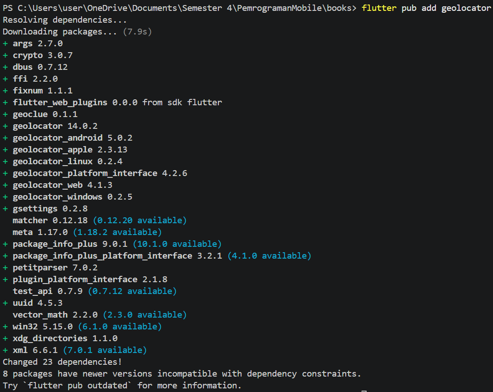

### Langkah 2: Tambah permission GPS
Jika Anda menargetkan untuk platform Android, maka tambahkan baris kode berikut di file android/app/src/main/androidmanifest.xml
```dart
<uses-permission android:name="android.permission.ACCESS_FINE_LOCATION"/>
<uses-permission android:name="android.permission.ACCESS_COARSE_LOCATION"/>
``` 

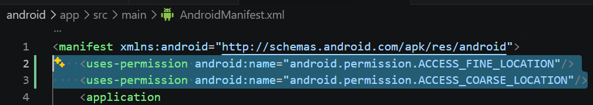

Jika Anda menargetkan untuk platform iOS, maka tambahkan kode ini ke file Info.plist

<key>NSLocationWhenInUseUsageDescription</key>
<string>This app needs to access your location</string>

### Langkah 3: Buat file geolocation.dart
Tambahkan file baru ini di folder lib project Anda.


### Langkah 4: Buat StatefulWidget
Buat class LocationScreen di dalam file geolocation.dart

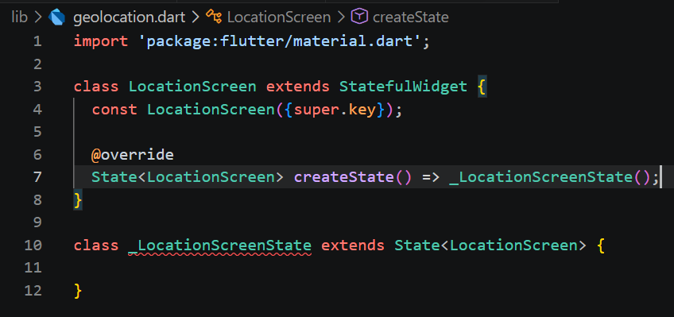

### Langkah 5: Isi kode geolocation.dart

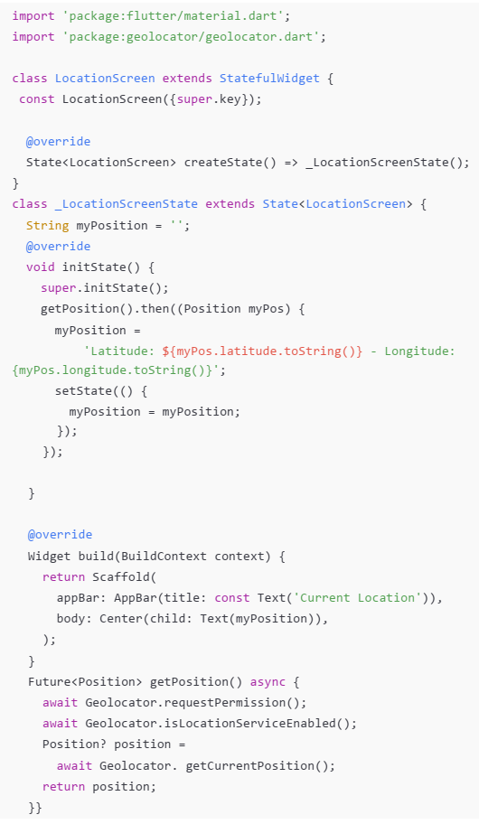

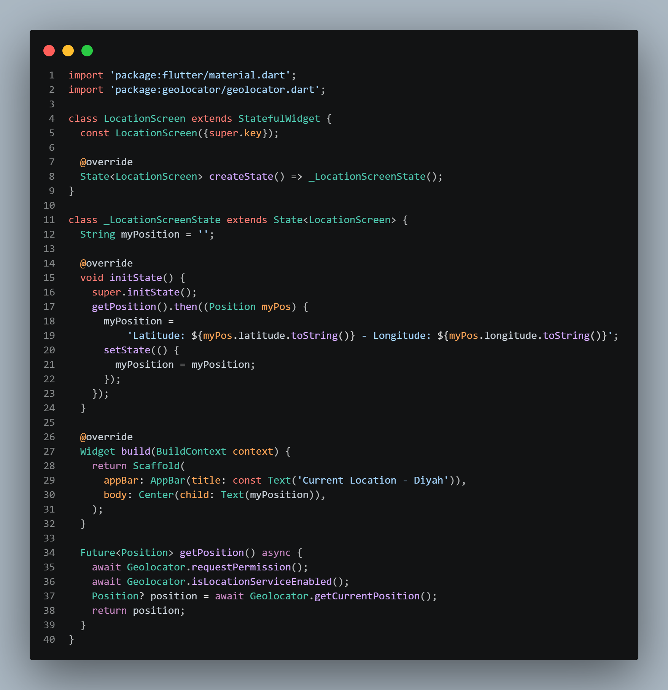

Soal 11
Tambahkan nama panggilan Anda pada tiap properti title sebagai identitas pekerjaan Anda

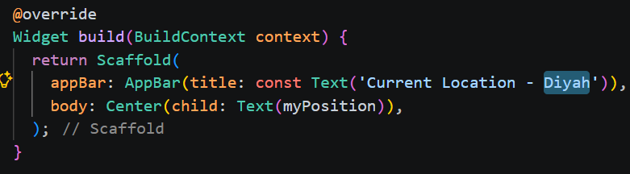

### Langkah 6: Edit main.dart
Panggil screen baru tersebut di file main Anda seperti berikut.
```dart
home: LocationScreen(),
```

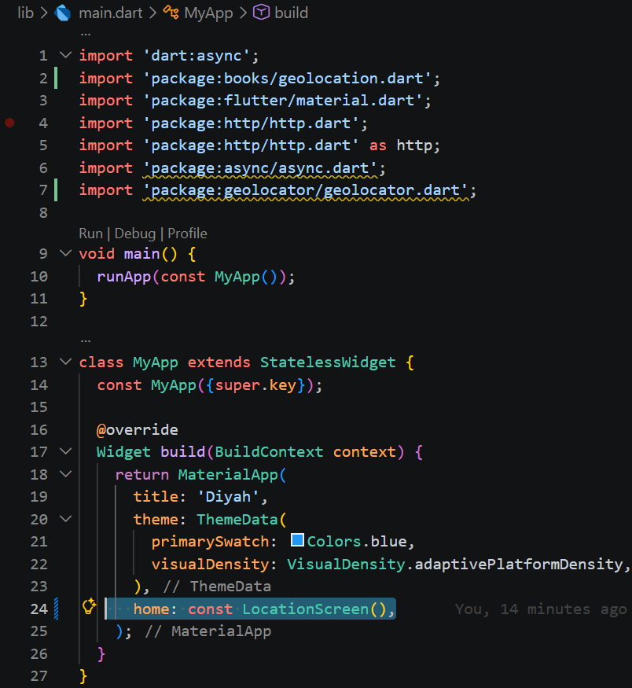

### Langkah 7: Run
Run project Anda di device atau emulator (bukan browser), maka akan tampil seperti berikut ini.

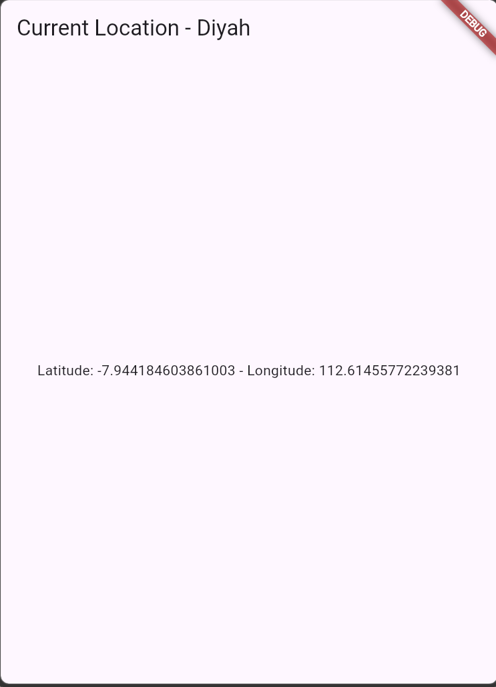

### Langkah 8: Tambahkan animasi loading
Tambahkan widget loading seperti kode berikut. Lalu hot restart, perhatikan perubahannya.

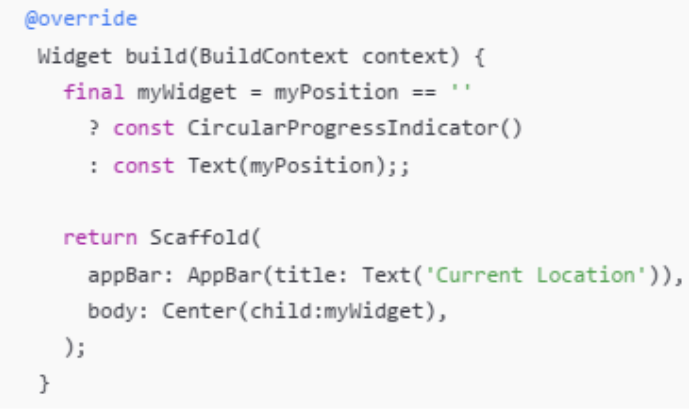

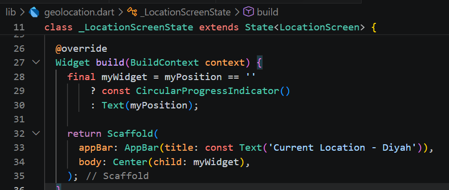

Soal 12
1. Jika Anda tidak melihat animasi loading tampil, kemungkinan itu berjalan sangat cepat. Tambahkan delay pada method getPosition() dengan kode await Future.delayed(const Duration(seconds: 3));

.png)

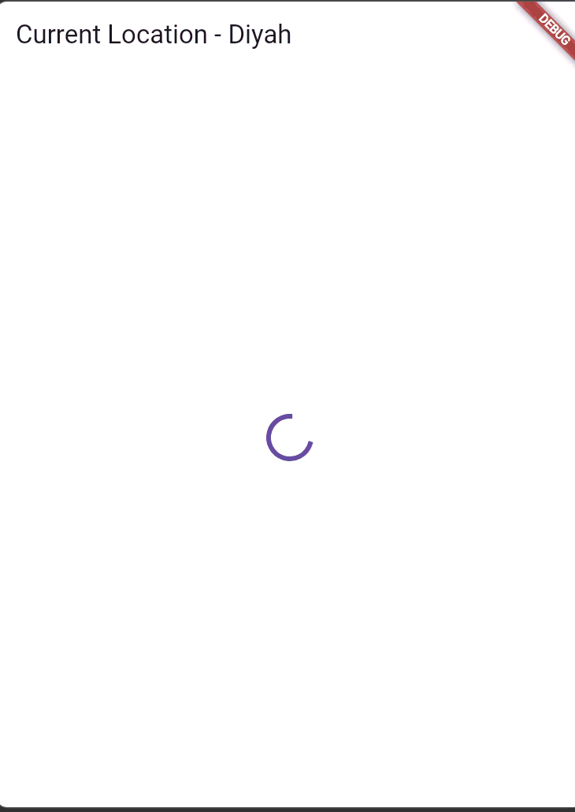

2. Apakah Anda mendapatkan koordinat GPS ketika run di browser? Mengapa demikian?

*Jawab*

Biasanya koordinat GPS itu tidak langsung muncul, bahkan bisa gagal kalau dijalankan lewat browser di emulator biasa. Karena browser punya aturan keamanan yang cukup ketat buat akses lokasi, dan emulator browser juga sering nggak punya akses langsung ke hardware GPS kayak di HP asli. Selain itu, plugin geolocator memang lebih dioptimalkan buat platform native seperti Android atau iOS, karena dia pakai API khusus dari sistem operasi tersebut.

3. Capture hasil praktikum Anda berupa GIF dan lampirkan di README. Lalu lakukan commit dengan pesan "W11: Soal 12".


Buka file geolocation.dart kemudian ganti isi method dengan kode ini.

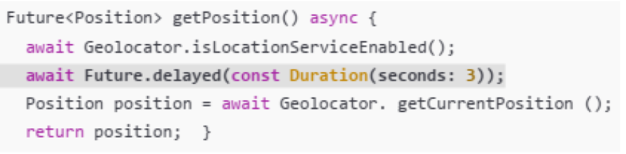

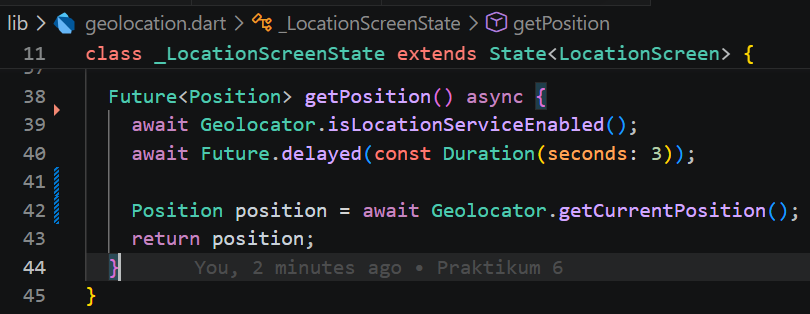

### Langkah 2: Tambah variabel
Tambah variabel ini di class _LocationScreenState

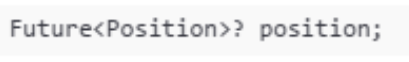

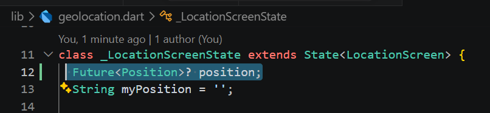

### Langkah 3: Tambah initState()
Tambah method ini dan set variabel position

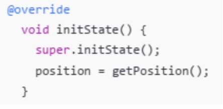

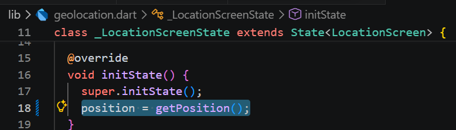

### Langkah 4: Edit method build()
Ketik kode berikut dan sesuaikan. Kode lama bisa Anda comment atau hapus.

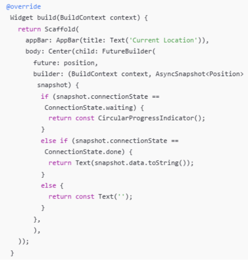

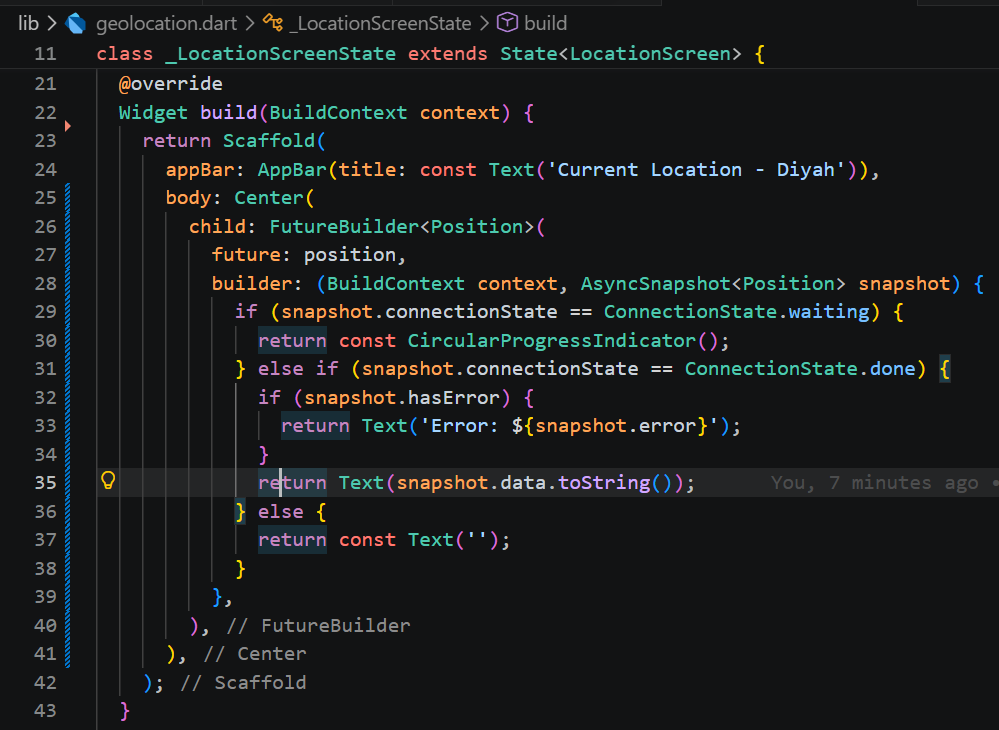

Soal 13
1. Apakah ada perbedaan UI dengan praktikum sebelumnya? Mengapa demikian?

*Jawab*

Secara tampilan, hasil akhirnya memang mirip karena sama-sama nunjukin animasi loading (CircularProgressIndicator) lalu menampilkan koordinat lokasi. Tapi sebenarnya cara bangun UI-nya beda.
Di praktikum sebelumnya, update tampilan dilakukan manual pakai variabel string dan setState() setelah data berhasil didapat. Jadi kita yang ngatur kapan UI harus berubah.

Sedangkan di praktikum sekarang, pakai FutureBuilder yang lebih otomatis. Widget ini langsung nge-handle perubahan state dari Future, mulai dari kondisi loading (waiting) sampai selesai (done) lewat snapshot. Jadi nggak perlu lagi ribet panggil setState() secara manual buat update UI, karena semuanya sudah diatur oleh FutureBuilder.

2. Capture hasil praktikum Anda berupa GIF dan lampirkan di README. Lalu lakukan commit dengan pesan "W11: Soal 13".

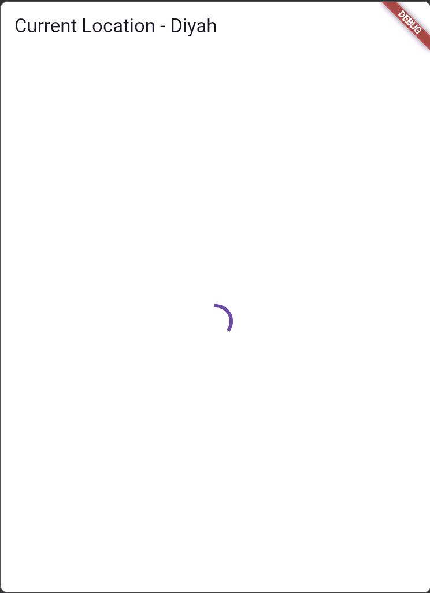

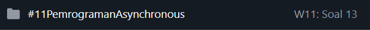

3. Seperti yang Anda lihat, menggunakan FutureBuilder lebih efisien, clean, dan reactive dengan Future bersama UI.

### Langkah 5: Tambah handling error
Tambahkan kode berikut untuk menangani ketika terjadi error. Kemudian hot restart.
```dart
else if (snapshot.connectionState == ConnectionState.done) {
  if (snapshot.hasError) {
     return Text('Something terrible happened!');
  }
  return Text(snapshot.data.toString());
}
```

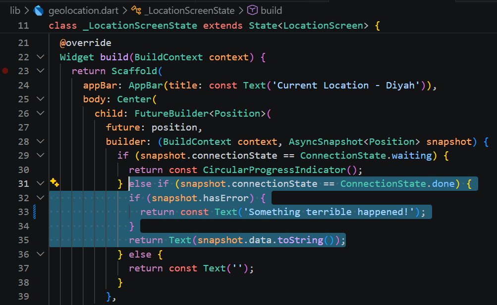

Soal 14
1. Apakah ada perbedaan UI dengan langkah sebelumnya? Mengapa demikian?

*Jawab*

Ya, ada perbedaan pada tampilan akhirnya. Kalau di praktikum sebelumnya setelah loading selesai yang muncul adalah koordinat GPS, di praktikum ini malah muncul teks “Something terrible happened!”. Hal ini karena di method getPosition() ditambahkan throw Exception(), yang sengaja bikin proses gagal dan mengirim status error ke FutureBuilder. Di dalam FutureBuilder, kondisi snapshot.hasError akan mendeteksi error tersebut, jadi UI diarahkan buat nampilin pesan error, bukan data koordinat.

2. Capture hasil praktikum Anda berupa GIF dan lampirkan di README. Lalu lakukan commit dengan pesan "W11: Soal 14".

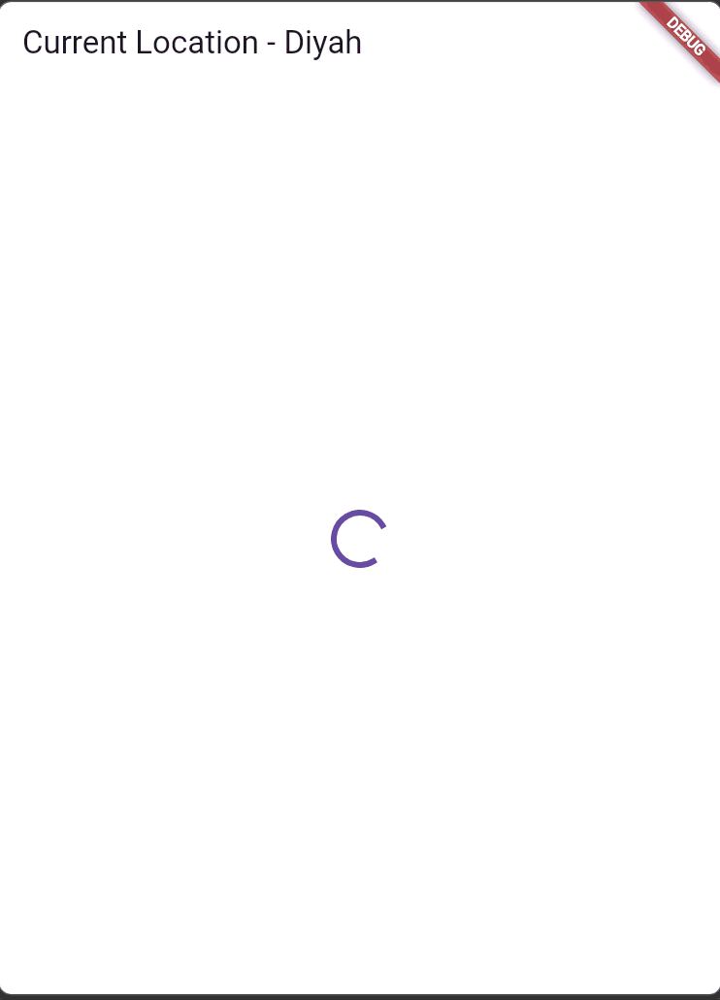


## Praktikum 8: Navigation route dengan Future Function
### Langkah 1: Buat file baru navigation_first.dart
Buatlah file baru ini di project lib Anda.

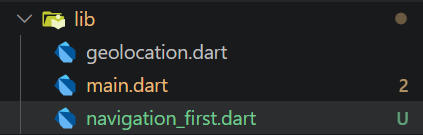

### Langkah 2: Isi kode navigation_first.dart

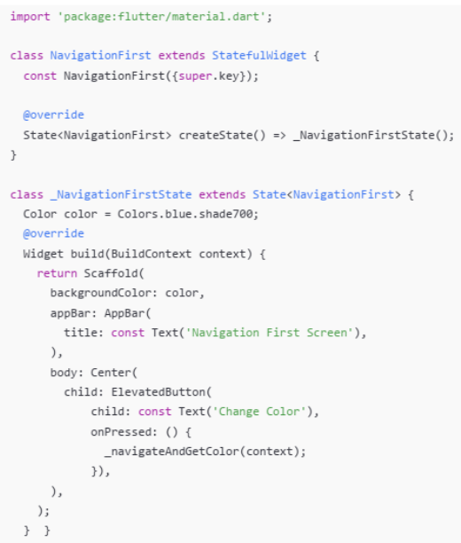

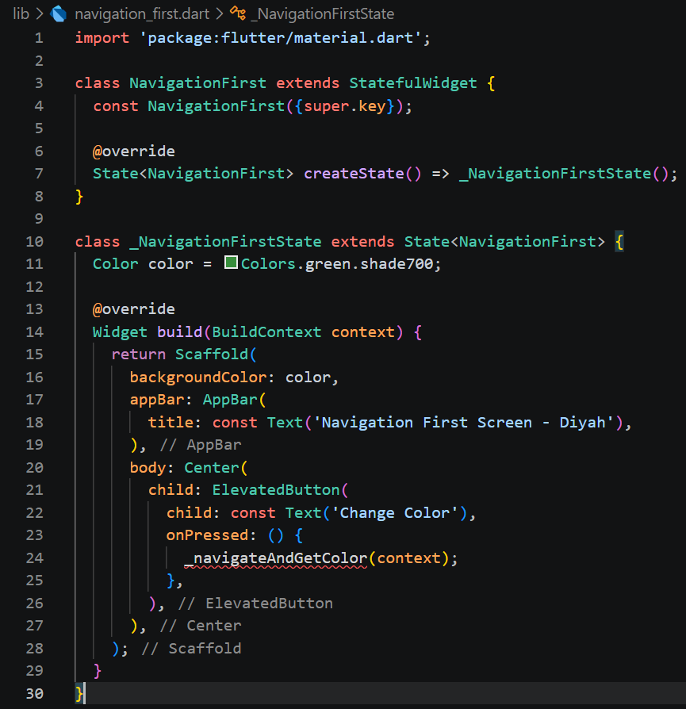

Soal 15
1. Tambahkan nama panggilan Anda pada tiap properti title sebagai identitas pekerjaan Anda.

.png)

2. Silakan ganti dengan warna tema favorit Anda.

.png)


### Langkah 3: Tambah method di class _NavigationFirstState
Tambahkan method ini.
```dart
Future _navigateAndGetColor(BuildContext context) async {
   color = await Navigator.push(context,
        MaterialPageRoute(builder: (context) => const NavigationSecond()),) ?? Colors.blue;
   setState(() {});
   });
}
```

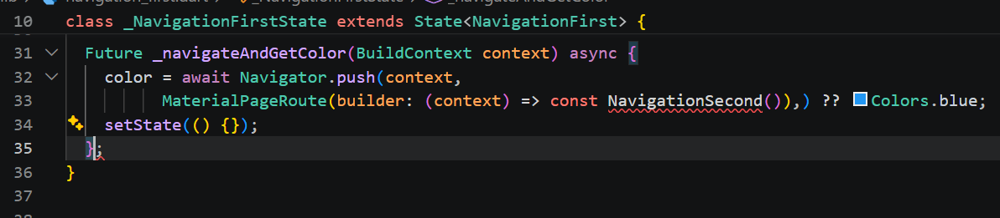

### Langkah 4: Buat file baru navigation_second.dart
Buat file baru ini di project lib Anda. Silakan jika ingin mengelompokkan view menjadi satu folder dan sesuaikan impor yang dibutuhkan.

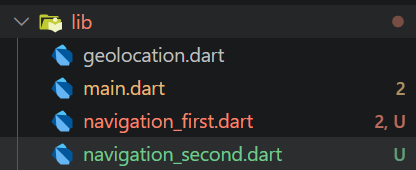

### Langkah 5: Buat class NavigationSecond dengan StatefulWidget

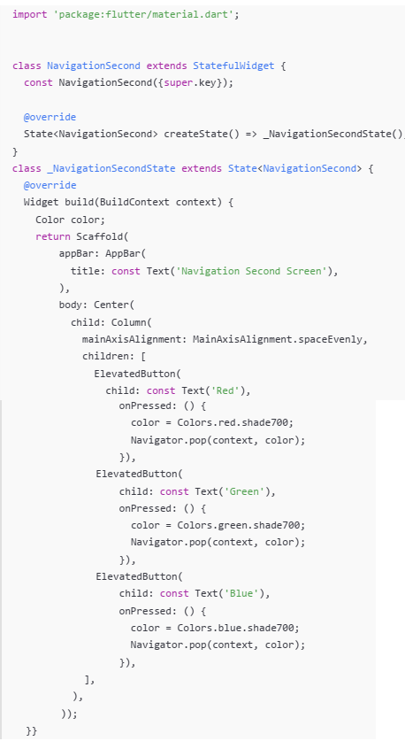

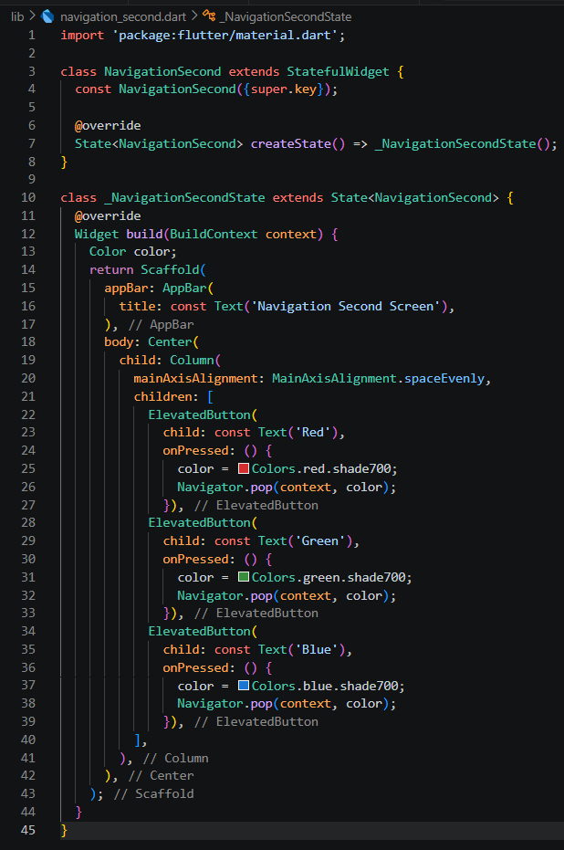

### Langkah 6: Edit main.dart
Lakukan edit properti home.
```dart
home: const NavigationFirst(),
```

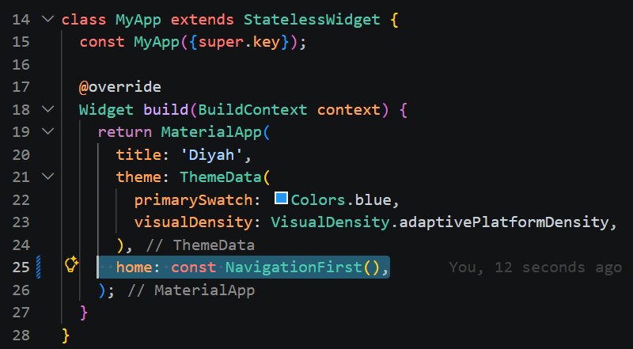

### Langkah 8: Run
Lakukan run, jika terjadi error silakan diperbaiki.

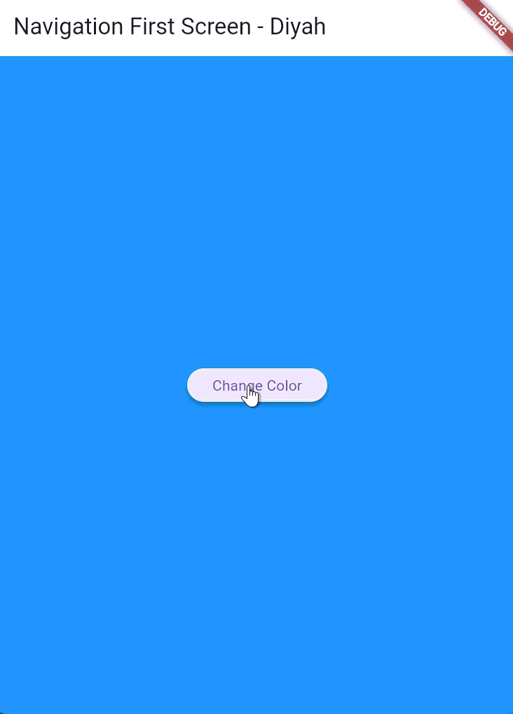

Soal 16
1. Cobalah klik setiap button, apa yang terjadi ? Mengapa demikian ?

*Jawab*

Saat salah satu tombol (Red, Green, atau Blue) di halaman NavigationSecond diklik, halaman tersebut langsung ditutup (kembali ke halaman pertama), dan warna background di NavigationFirst berubah sesuai tombol yang dipilih.
Hal ini bisa terjadi karena ada mekanisme pengiriman nilai lewat Navigator. Di NavigationSecond, fungsi Navigator.pop(context, color) dipakai buat ngirim data warna ke halaman sebelumnya. Lalu di NavigationFirst, method _navigateAndGetColor pakai await untuk nunggu hasil itu. Setelah nilainya diterima, setState() dipanggil buat update variabel warna, sehingga UI langsung ke-render ulang dengan warna yang baru.

2. Gantilah 3 warna pada langkah 5 dengan warna favorit Anda!

.png)

3. Capture hasil praktikum Anda berupa GIF dan lampirkan di README. Lalu lakukan commit dengan pesan "W11: Soal 16".

.gif)

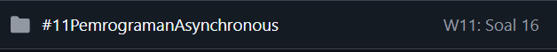


## Praktikum 9: Memanfaatkan async/await dengan Widget Dialog
### Langkah 1: Buat file baru navigation_dialog.dart
Buat file dart baru di folder lib project Anda.

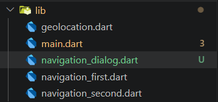

### Langkah 2: Isi kode navigation_dialog.dart

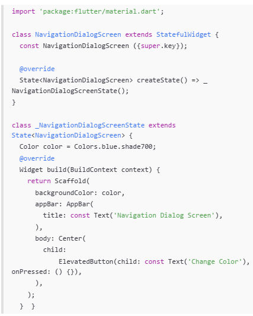

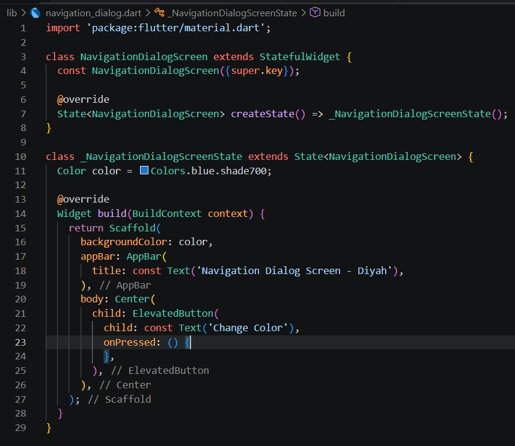

### Langkah 3: Tambah method async

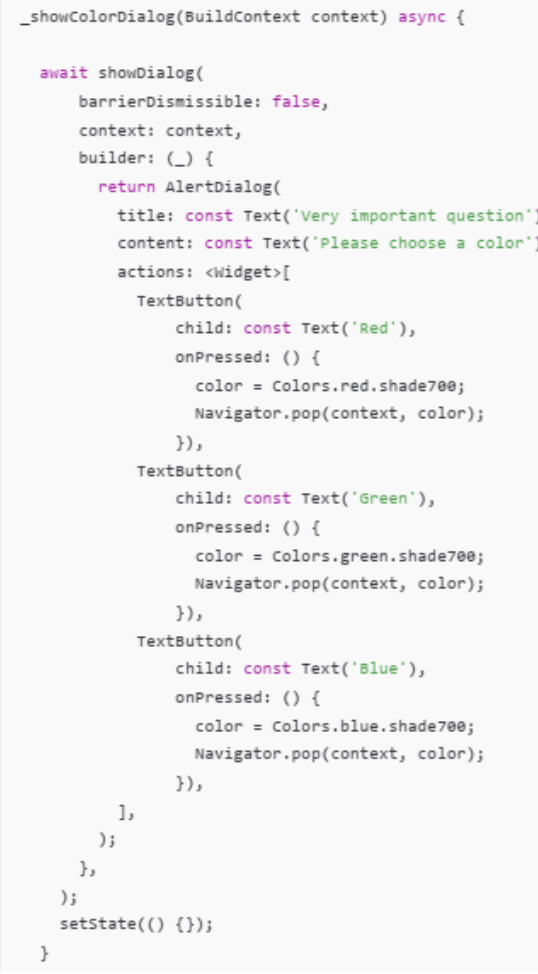

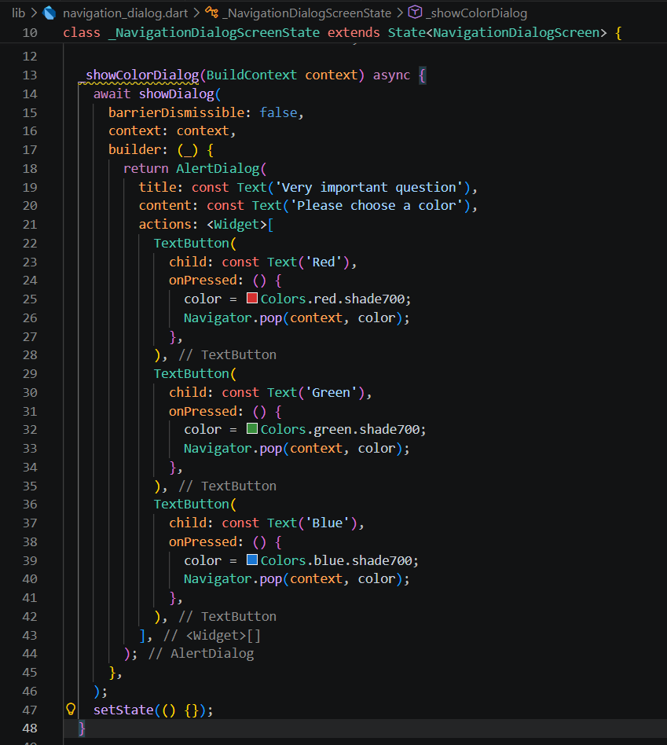

### Langkah 4: Panggil method di ElevatedButton
```dart
onPressed: () {
_showColorDialog(context);
}),
```

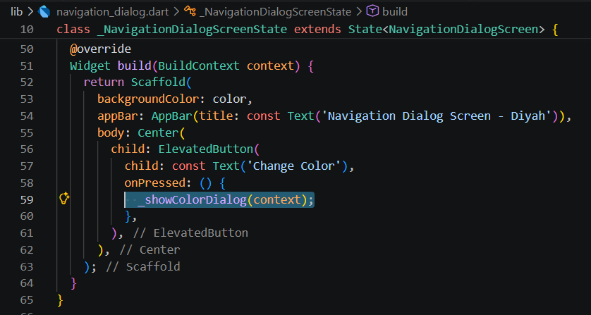

### Langkah 5: Edit main.dart
Ubah properti home
```dart
home: const NavigationDialog(),
```

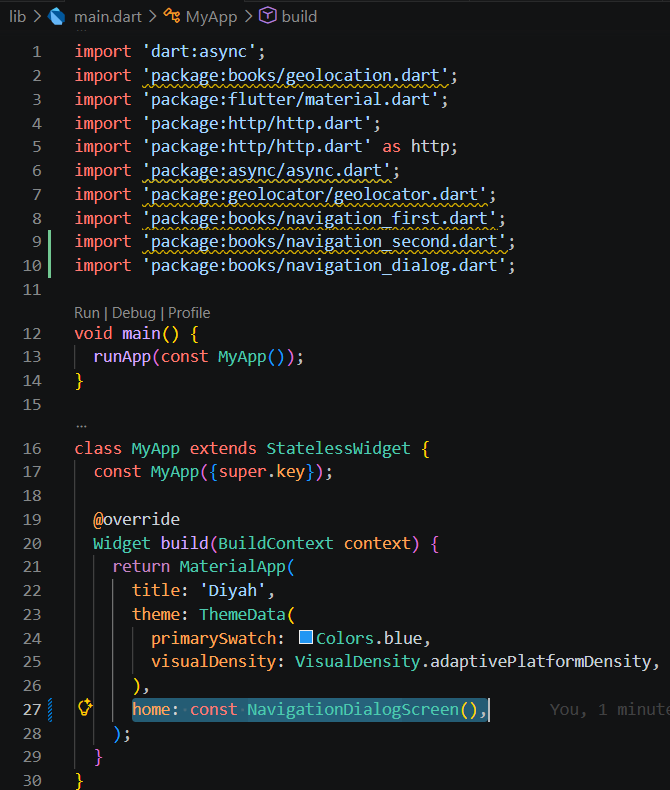

### Langkah 6: Run
Coba ganti warna background dengan widget dialog tersebut. Jika terjadi error, silakan diperbaiki. Jika berhasil, akan tampil seperti gambar berikut.

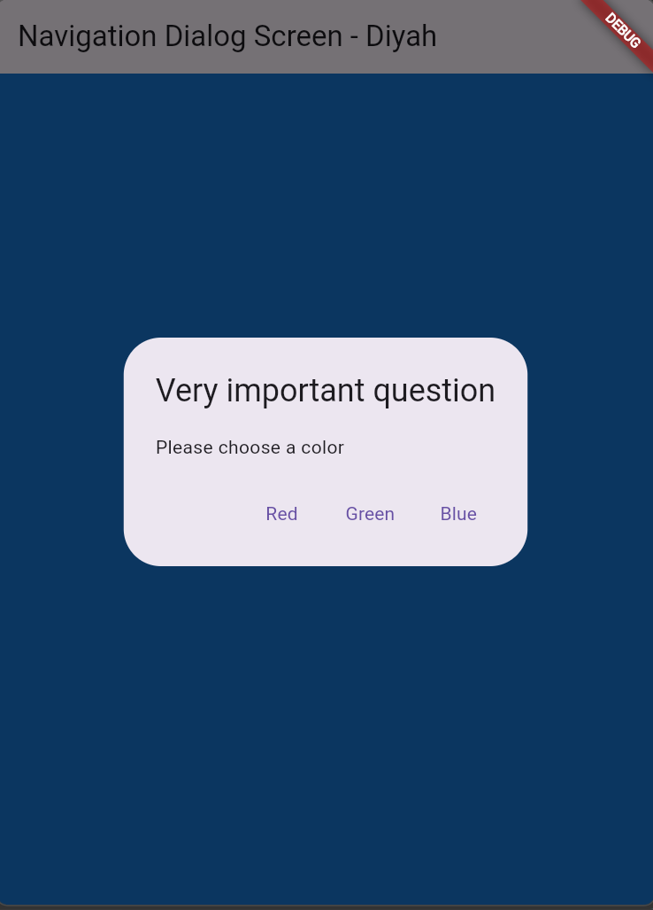

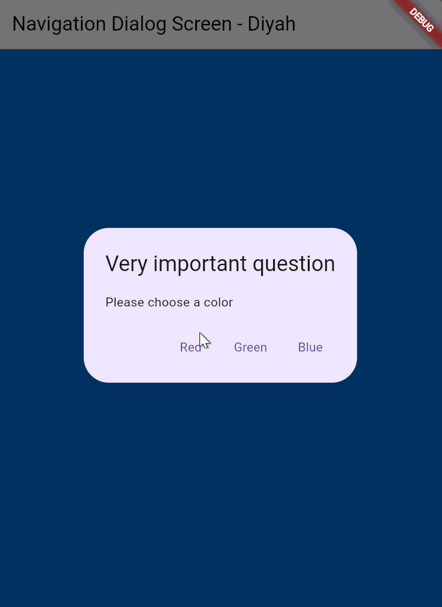

Soal 17
1. Cobalah klik setiap button, apa yang terjadi ? Mengapa demikian ?

*Jawab*

Saat salah satu tombol (Red, Green, atau Blue) di dalam dialog diklik, dialognya langsung tertutup, lalu warna background di halaman NavigationDialogScreen berubah sesuai warna yang dipilih.

Ini terjadi karena tiap tombol memanggil Navigator.pop(context, color) yang ngirim nilai warna ke method pemanggil (_showColorDialog). Di method itu ada await showDialog, jadi program nunggu sampai dialog ditutup dulu. Setelah itu, setState() dijalankan untuk update nilai variabel warna, sehingga UI langsung ke-render ulang dengan warna yang baru.

2. Gantilah 3 warna pada langkah 3 dengan warna favorit Anda!

.png)

3. Capture hasil praktikum Anda berupa GIF dan lampirkan di README. Lalu lakukan commit dengan pesan "W11: Soal 17".

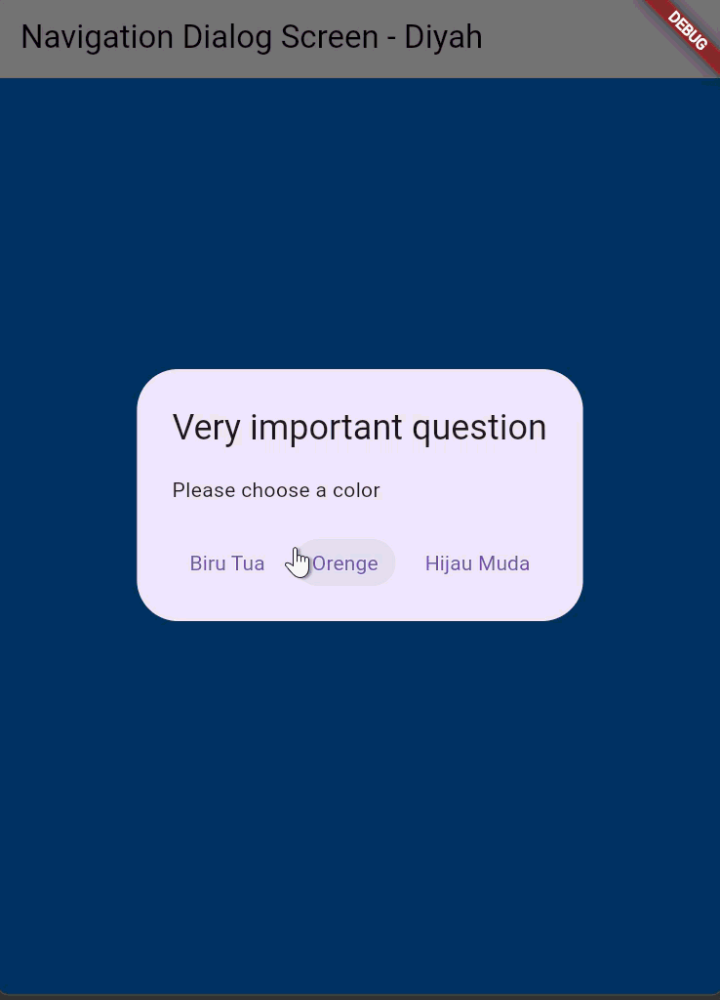